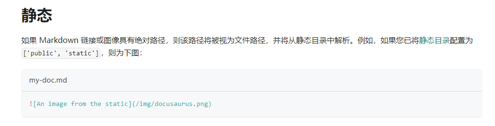
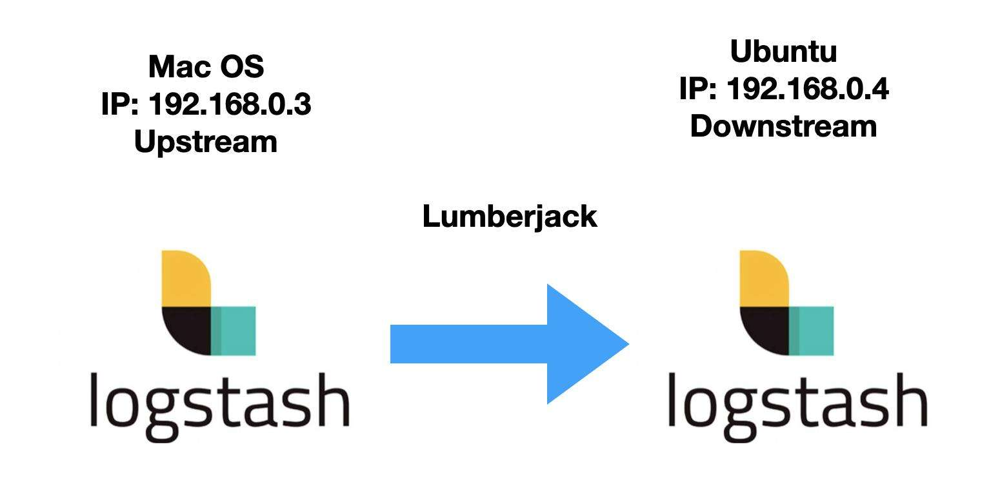

> 申明：本文为学习过程中的笔记，在现有的资料基础之上做了学习和整理，非完全原创的。引用资料见文末，参考资料。







官方文档：[InfluxDB 1.7 documentation | InfluxData Documentation](https://docs.influxdata.com/influxdb/v1.7/)


## h2

### h3
#### h4
##### h5
###### h6

InfluxDB 是使用 GO 编写的基于时间序列的数据库，用于存储大量带有时间戳的数据，报错 DevOps 监控，日志数据，应用程序的指标、数据分析数据等等。通过 InfluxDB 自动保存数据，你不需要删除和清理，只需要定义一段时间 DB 会帮你自动清理。

InfluxDB 提供三种操作方式：

- 客户端命令行方式

- HTTP API 接口

- 各语言 API 库


### 2. 关键概念

#### 基本概念

InfluxDB 和传统数据库（如：MySQL）的一些区别

|  InfluxDB   | 传统数据库中的概念 |
| :---------: | :----------------: |
|  database   |       数据库       |
| measurement |    数据库中的表    |
|   points    |  表里面的一行数据  |

#### 特有概念

1. tag--标签，在 InfluxDB 中，tag 是一个非常重要的部分，表名+tag 一起作为数据库的索引，是“key-value”的形式

2. field--数据，field 主要是用来存放数据的部分，也是“key-value”的形式

3. timestamp--时间戳，作为时序型数据库，时间戳是 InfluxDB 中最重要的部分，在插入数据时可以自己指定也可留空让系统指定

   **说明**：*在插入新数据时，tag、field 和 timestamp 之间用空格分隔*

4. series--序列，所有在数据库中的数据，都需要通过图表来展示，而这个 series 表示这个表里面的数据，可以在图表上画成几条线。具体可以通过 `SHOW SERIES FROM "表名"` 进行查询

5. Retention policy--数据保留策略，可以定义数据保留的时长，每个数据库可以有多个数据保留策略，但只能有一个默认策略

6. Point--点，表示每个表里某个时刻的某个条件下的一个 field 的数据，因为体现在图表上就是一个点，于是将其称为 point。Point 由时间戳（time）、数据（field）、标签（tags）组成

| Point 属性 |                  传统数据库中的概念                   |
| :--------: | :---------------------------------------------------: |
|    time    |   每个数据记录时间，是数据库中的主索引 (会自动生成)   |
|   fields   | 表中的列（没有索引的属性）也就是记录的值：温度， 湿度 |
|    tags    |                表中的索引：地区，海拔                 |


### 3. 端口服务

- 8083：Web admin 管理服务的端口, http://localhost:8083
- 8086：HTTP API 的端口
- 8088：集群端口 (目前还不是很清楚, 配置在全局的 bind-address，默认不配置就是开启的)


## 二、安装

### 1. 基于 Linux CentOS 安装

```shell
wget https://dl.influxdata.com/influxdb/releases/influxdb-0.13.0.x86_64.rpm
sudo yum localinstall influxdb-0.13.0.x86_64.rpm
```


### 2. 基于 Docker 安装

```shell
docker run -d -p 8083:8083 -p8086:8086 --expose 8090 --expose 8099 --name influxDbService influxdb
```

- -d：容器在后台运行

- -p：将容器内端口映射到宿主机端口，格式为 宿主机端口:容器内端口；8083 是 influxdb 的 web 管理工具端口，8086 是 influxdb 的 HTTP API 端口

- --expose：可以让容器接受外部传入的数据

- --name：容器名称  此处 influxDbService 则是启动后的容器名

- 最后是镜像名称 influxdb，镜像名可以通过 docker images 查看； 通过 tag 区分启镜像版本
- 若不加 tag 则启动的是最新版本 latest


## 三、可视化客户端安装

客户端为绿色版，下载解压打开即可。下载地址：[Releases · CymaticLabs/InfluxDBStudio](https://github.com/CymaticLabs/InfluxDBStudio/releases)

- 这里也提供 InfluxDB Studio 的使用说明，供大家参考：[windows 下 influxDB 操作工具 InfluxDBStudio ](https://cloud.tencent.com/developer/article/1444098)


## 四、客户端命令操作（基本语法）

### 1. 数据库操作

#### 创建

CREATE DATABASE {NAME};

```sql
> create database frank
> show databases
name: databases
name
----
_internal
telegraf
frank
```

- 这时候我们发现数据库有一个表“_internal”，其实这个表是 influxdb 数据库的一些指标存储库。有点类似 mysql 数据库的 mysql 库。

#### 删除

DROP DATABASE {NAME};

```sql
> drop database frank
```

#### 使用

DROP {DB};

```sql
> use frank
Using database frank
```


### 2. 数据表和数据操作

建库的操作可以发现非常类似于 MySQL 下的操作。而在 InfluxDB 下没有细分的表的概念，InfluxDB 下的表在插入数据库的时候自动会创建。可以通过 `show measurements` 命令查看所有的表，这个类似于 MySQL 下的`show tables`

#### 显示所有表

```sql
> show measurements
name: measurements
name
----
cpu
temperature
```

#### 新建表（写数据）

标准格式，注意在写数据的时候如果不添加时间戳，系统会默认添加一个时间。InfluxDB 中没有显式的新建表的语句，只能通过 insert 数据的方式来建立新表。

- 语法格式

```sql
insert <measurement>[,<tag-key>=<tag-value>...] <field-key>=<field-value>[,<field2-key>=<field2-value>...] [unix-nano-timestamp]
```

- 示例

```sql
> INSERT cpu,host=serverA,region=us_west value=0.64

> INSERT temperature,machine=unit42,type=assembly external=25,internal=37 1434067467000000000
```


#### 删除表

```sql
> drop measurement disk_free
> show measurements
name: measurements
------------------
name
weather
```


#### 读数据

查询语句与 SQL 一样，不用过多的学习

- 查询数据

```sql
> SELECT "host", "region", "value" FROM "cpu"
name: cpu
time                host    region  value
----                ----    ------  -----
1563895618490964877 serverA us_west 0.64
```

- 每个表输出一行（支持 Go 语言的正则表达式、支持类似于 MySQL 中的 limit 语句）

```sql
> SELECT * FROM /.*/ LIMIT 1
name: cpu
time                external host    internal machine region  type value
----                -------- ----    -------- ------- ------  ---- -----
1563895618490964877          serverA                  us_west      0.64

name: temperature
time                external host internal machine region type     value
----                -------- ---- -------- ------- ------ ----     -----
1434067467000000000 25            37       unit42         assembly
```


#### 修改和删除数据

InfluxDB 属于时序数据库，没有提供修改和删除数据的方法。

但是删除可以通过 InfluxDB 的数据保存策略（Retention Policies）来实现


update 更新语句没有，不过有 alter 命令，在 influxdb 中，删除操作用和更新基本不用到 。在针对数据保存策略方面，有一个特殊的删除方式，这个后面再提。


### 3. series 操作

series 表示这个表里面的数据，可以在图表上画成几条线，series 主要通过 tags 排列组合算出来。

我们可以查询表的 series，如下所示：

```shell
> show series from mem
key
mem,host=ResourcePool-0246-billing07
mem,host=billing07
```


### 4. 用户操作

```shell
# 显示用户
SHOW USERS
# 创建用户
CREATE USER "username" WITH PASSWORD 'password'
# 创建管理员权限的用户
CREATE USER "username" WITH PASSWORD 'password' WITH ALL PRIVILEGES
# 删除用户
DROP USER "username"
```

influxdb 的权限设置比较简单，只有读、写、ALL 几种。


## 五、HTTP API 操作

### 接口地址

| 接口路径        | 描述                             |
| --------------- | -------------------------------- |
| /debug/pprof    | debug 排查问题使用               |
| /debug/requests | 使用这个请求监听最近是否有请求   |
| /debug/vars     | 查询 influxdb 收集到静态信息     |
| /ping           | 检测 influxdb 状态               |
| /query          | 查询数据接口（同时可以创建 ku）  |
| /write          | 写入数据接口（一个已存在数据库） |


### 状态码

- 2xx：服务请求正常
- 4xx：代表请求语法有问题
- 5xx：服务端出问题，导致超时等故障


### 1. 创建数据库

```shell
curl -i -XPOST http://localhost:8086/query --data-urlencode "q=CREATE DATABASE mydb"
HTTP/1.1 200 OK
Content-Type: application/json
Request-Id: 5edd88a8-ef90-11e8-83cd-a0999b0f94e3
X-Influxdb-Build: OSS
X-Influxdb-Version: 1.7.0~n201811230800
X-Request-Id: 5edd88a8-ef90-11e8-83cd-a0999b0f94e3
Date: Sat, 24 Nov 2018 02:26:38 GMT
Transfer-Encoding: chunked
{"results":[{"statement_id":0}]}
```


### 2. 写入数据

```shell
curl -i  -XPOST 'http://localhost:8086/write?db=mydb' --data-binary 'cpu_load_short,host=server01,region=us-west value=0.65 1434055564000000000'
HTTP/1.1 204 No Content
Content-Type: application/json
Request-Id: 1ae386c4-ef91-11e8-83d8-a0999b0f94e3
X-Influxdb-Build: OSS
X-Influxdb-Version: 1.7.0~n201811230800
X-Request-Id: 1ae386c4-ef91-11e8-83d8-a0999b0f94e3
Date: Sat, 24 Nov 2018 02:31:53 GMT
```


### 3. 写入多个数据点

```shell
 curl -i -XPOST 'http://localhost:8086/write?db=mydb' --data-binary 'cpu_load_short,host=server02 value=0.67
```

> cpu_load_short,host=server02,region=us-west value=0.55 1422568543702900257
> cpu_load_short,direction=in,host=server01,region=us-west value=2.0 1422568543702900257'
> HTTP/1.1 204 No Content
> Content-Type: application/json
> Request-Id: 574f52a0-ef91-11e8-83d9-a0999b0f94e3
> X-Influxdb-Build: OSS
> X-Influxdb-Version: 1.7.0~n201811230800
> X-Request-Id: 574f52a0-ef91-11e8-83d9-a0999b0f94e3
> Date: Sat, 24 Nov 2018 02:33:34 GMT


### 4. 从文件导入数据库

从文件导入时候建议不要超过 5000 条，如果超过请对文件进行切割，因为 http api 的接口 5s 会超时，请求数据过多会导致数据无法确认是否成功。
文件 cpu_data.txt 内容如下：

```shell
cpu_load_short,host=server02 value=111
cpu_load_short,host=server02,region=us-west value=0.222 1543027130702900257
cpu_load_short,direction=in,host=server01,region=us-west value=111.222 1543027129702900257
curl -i -XPOST 'http://localhost:8086/write?db=mydb' --data-binary @cpu_data.txt
```

> HTTP/1.1 204 No Content
> Content-Type: application/json
> Request-Id: 4b2ed710-ef92-11e8-83e3-a0999b0f94e3
> X-Influxdb-Build: OSS
> X-Influxdb-Version: 1.7.0~n201811230800
> X-Request-Id: 4b2ed710-ef92-11e8-83e3-a0999b0f94e3
> Date: Sat, 24 Nov 2018 02:40:24 GMT


## 六、数据保存策略（Retention Policies）

InfluxDB 每秒可以处理成千上万条数据，要将这些数据全部保存下来会占用大量的存储空间，有时我们可能并不需要将所有历史数据进行存储。InfluxDB 没有提供直接删除 Points 的方法，但是它提供了 Retention Policies，用来让我们自定义数据的保留时间。

### 1. 查看

```bash
SHOW RETENTION POLICIES ON "testDB"
```

### 2. 创建

```bash
CREATE RETENTION POLICY "rp_name" ON "db_name" DURATION 30d REPLICATION 1 DEFAULT
```

其中：

1. rp_name：策略名
2. db_name：具体的数据库名
3. 30d：保存 30 天，30 天之前的数据将被删除
   它具有各种时间参数，比如：h（小时），w（星期）
4. REPLICATION 1：副本个数，这里填 1 就可以了
5. DEFAULT 设为默认的策略

### 3. 修改

```bash
ALTER RETENTION POLICY "rp_name" ON db_name" DURATION 3w DEFAULT
```

### 4. 删除

```bash
DROP RETENTION POLICY "rp_name" ON "db_name"
```


## 七、常用函数

InfluxDB 提供了很多的有用的函数，这里列举了常用的三个维度函数，Use InfluxQL functions to aggregate, select, and transform data.

| Aggregations                                                 | Selectors                                                    | Transformations                                              |
| ------------------------------------------------------------ | ------------------------------------------------------------ | ------------------------------------------------------------ |
| [COUNT()](https://docs.influxdata.com/influxdb/v0.13/query_language/functions/#count) | [BOTTOM()](https://docs.influxdata.com/influxdb/v0.13/query_language/functions/#bottom) | [CEILING()](https://docs.influxdata.com/influxdb/v0.13/query_language/functions/#ceiling) |
| [DISTINCT()](https://docs.influxdata.com/influxdb/v0.13/query_language/functions/#distinct) | [FIRST()](https://docs.influxdata.com/influxdb/v0.13/query_language/functions/#first) | [DERIVATIVE()](https://docs.influxdata.com/influxdb/v0.13/query_language/functions/#derivative) |
| [INTEGRAL()](https://docs.influxdata.com/influxdb/v0.13/query_language/functions/#integral) | [LAST()](https://docs.influxdata.com/influxdb/v0.13/query_language/functions/#last) | [DIFFERENCE()](https://docs.influxdata.com/influxdb/v0.13/query_language/functions/#difference) |
| [MEAN()](https://docs.influxdata.com/influxdb/v0.13/query_language/functions/#mean) | [MAX()](https://docs.influxdata.com/influxdb/v0.13/query_language/functions/#max) | [ELAPSED()](https://docs.influxdata.com/influxdb/v0.13/query_language/functions/#elapsed) |
| [MEDIAN()](https://docs.influxdata.com/influxdb/v0.13/query_language/functions/#median) | [MIN()](https://docs.influxdata.com/influxdb/v0.13/query_language/functions/#min) | [FLOOR()](https://docs.influxdata.com/influxdb/v0.13/query_language/functions/#floor) |
| [SPREAD()](https://docs.influxdata.com/influxdb/v0.13/query_language/functions/#spread) | [PERCENTILE()](https://docs.influxdata.com/influxdb/v0.13/query_language/functions/#percentile) | [HISTOGRAM()](https://docs.influxdata.com/influxdb/v0.13/query_language/functions/#histogram) |
| [SUM()](https://docs.influxdata.com/influxdb/v0.13/query_language/functions/#sum) | [TOP()](https://docs.influxdata.com/influxdb/v0.13/query_language/functions/#top) | [MOVING_AVERAGE()](https://docs.influxdata.com/influxdb/v0.13/query_language/functions/#moving-average) |
|                                                              |                                                              | [NON_NEGATIVE_DERIVATIVE()](https://docs.influxdata.com/influxdb/v0.13/query_language/functions/#non-negative-derivative) |
|                                                              |                                                              | [STDDEV()](https://docs.influxdata.com/influxdb/v0.13/query_language/functions/#stddev) |


### 1. 聚合类函数

#### 1）COUNT() 函数

返回一个（field）字段中的非空值的数量。

语法：

```sql
SELECT COUNT(<field_key>) FROM <measurement_name> [WHERE <stuff>] [GROUP BY <stuff>]
```

示例：

```sql
> SELECT COUNT(water_level) FROM h2o_feet
name: h2o_feet
--------------
time                           count
1970-01-01T00:00:00Z     15258
```

说明 water_level 这个字段在 h2o_feet 表中共有 15258 条数据。

注意：InfluxDB 中的函数如果没有指定时间的话，会默认以 epoch 0 (`1970-01-01T00:00:00Z`) 作为时间。

可以在 where 中加入时间条件，如下：

```sql
> SELECT COUNT(water_level) FROM h2o_feet WHERE time >= '2015-08-18T00:00:00Z' AND time < '2015-09-18T17:00:00Z' GROUP BY time(4d)
name: h2o_feet
--------------
time                           count
2015-08-17T00:00:00Z     1440
2015-08-21T00:00:00Z     1920
2015-08-25T00:00:00Z     1920
2015-08-29T00:00:00Z     1920
2015-09-02T00:00:00Z     1915
2015-09-06T00:00:00Z     1920
2015-09-10T00:00:00Z     1920
2015-09-14T00:00:00Z     1920
2015-09-18T00:00:00Z     335
```

#### 2）DISTINCT() 函数

返回一个字段（field）的唯一值。

语法：

```sql
SELECT DISTINCT(<field_key>) FROM <measurement_name> [WHERE <stuff>] [GROUP BY <stuff>]
```

使用示例

```sql
> SELECT DISTINCT("level description") FROM h2o_feet
name: h2o_feet
--------------
time                           distinct
1970-01-01T00:00:00Z     between 6 and 9 feet
1970-01-01T00:00:00Z     below 3 feet
1970-01-01T00:00:00Z     between 3 and 6 feet
1970-01-01T00:00:00Z     at or greater than 9 feet
```

这个例子显示 level description 这个字段共有四个值，然后将其显示了出来，时间为默认时间。


#### 3）MEAN() 函数

返回一个字段（field）中的值的算术平均值（平均值）。字段类型必须是长整型或 float64。

语法格式：

```sql
SELECT MEAN(<field_key>) FROM <measurement_name> [WHERE <stuff>] [GROUP BY <stuff>]
```

使用示例

```sql
> SELECT MEAN(water_level) FROM h2o_feet
name: h2o_feet
--------------
time                           mean
1970-01-01T00:00:00Z     4.286791371454075
```

说明 water_level 字段的平均值为`4.286791371454075`，时间为默认时间，当然，你也可以加入 where 条件。


#### 4）MEDIAN() 函数

从单个字段（field）中的排序值返回中间值（中位数）。字段值的类型必须是长整型或 float64 格式。

语法：

```sql
SELECT MEDIAN(<field_key>) FROM <measurement_name> [WHERE <stuff>] [GROUP BY <stuff>]
```

使用示例

```sql
> SELECT MEDIAN(water_level) from h2o_feet
name: h2o_feet
--------------
time                           median
1970-01-01T00:00:00Z     4.124
```

说明表中 water_level 字段的中位数是 4.124


#### 5）SPREAD() 函数

返回字段的最小值和最大值之间的差值。数据的类型必须是长整型或 float64。

语法：

```sql
SELECT SPREAD(<field_key>) FROM <measurement_name> [WHERE <stuff>] [GROUP BY <stuff>]
```

使用示例

```sql
> SELECT SPREAD(water_level) FROM h2o_feet
name: h2o_feet
--------------
time                            spread
1970-01-01T00:00:00Z      10.574
```


#### 6）SUM() 函数

返回一个字段中的所有值的和。字段的类型必须是长整型或 float64。

语法：

```sql
SELECT SUM(<field_key>) FROM <measurement_name> [WHERE <stuff>] [GROUP BY <stuff>]
```

使用示例：

```sql
> SELECT SUM(water_level) FROM h2o_feet
name: h2o_feet
--------------
time                           sum
1970-01-01T00:00:00Z     67777.66900000002
```

此语句计算出了 h2o_feet 表中 所有 water_level 字段的和。


### 2. 选择类函数

#### 1）TOP() 函数

作用：返回一个字段中最大的 N 个值，字段类型必须是长整型或 float64 类型。

语法：

```sql
SELECT TOP( <field_key>[,<tag_key(s)>],<N> )[,<tag_key(s)>|<field_key(s)>] [INTO_clause] FROM_clause [WHERE_clause] [GROUP_BY_clause] [ORDER_BY_clause] [LIMIT_clause] [OFFSET_clause] [SLIMIT_clause] [SOFFSET_clause]
```

使用示例

```sql
> SELECT TOP("water_level",3) FROM "h2o_feet"

name: h2o_feet
time                   top
----                   ---
2015-08-29T07:18:00Z   9.957
2015-08-29T07:24:00Z   9.964
2015-08-29T07:30:00Z   9.954
```

这个例子返回表中 water_level 字段中最大的三个值。


#### 2）BOTTOM() 函数

作用：返回一个字段中最小的 N 个值。字段类型必须是长整型或 float64 类型。

语法：

```sql
SELECT BOTTOM(<field_key>[,<tag_keys>],<N>)[,<tag_keys>] FROM <measurement_name> [WHERE <stuff>] [GROUP BY <stuff>]
```

使用示例

```sql
> SELECT BOTTOM(water_level,3) FROM h2o_feet
name: h2o_feet
--------------
time                           bottom
2015-08-29T14:30:00Z     -0.61
2015-08-29T14:36:00Z     -0.591
2015-08-30T15:18:00Z     -0.594
```

这个例子返回表中 water_level 字段中最小的三个值。

也可将关联 tag 放在一起查询，但如果 tag 值少于 N 的值，则返回的值的个数只会取 tag 中字段值少的那个。

如下所示：

```sql
> SELECT BOTTOM(water_level,location,3) FROM h2o_feet
name: h2o_feet
--------------
time                           bottom     location
2015-08-29T10:36:00Z     -0.243     santa_monica
2015-08-29T14:30:00Z     -0.61      coyote_creek
```

语句取最小的三个值，然而结果只返回了 2 个值，因为 location 这个 tag 只有 两个取值。


#### 3）FIRST() 函数

作用：返回一个字段中最老的取值。

语法：

```sql
SELECT FIRST(<field_key>)[,<tag_key(s)>] FROM <measurement_name> [WHERE <stuff>] [GROUP BY <stuff>]
```

示例：

```sql
> SELECT FIRST(water_level) FROM h2o_feet WHERE location = 'santa_monica'
name: h2o_feet
--------------
time                           first
2015-08-18T00:00:00Z     2.064
```

这个语句返回了 在 location 为 santa_monica 条件下，最旧的那个 water_level 字段的取值和时间。


#### 4）LAST() 函数

作用：返回一个字段中最新的取值。

语法：

```sql
SELECT LAST(<field_key>)[,<tag_key(s)>] FROM <measurement_name> [WHERE <stuff>] [GROUP BY <stuff>]
```

示例：

```sql
> SELECT LAST(water_level),location FROM h2o_feet WHERE time >= '2015-08-18T00:42:00Z' and time <= '2015-08-18T00:54:00Z'
name: h2o_feet
--------------
time                           last      location
2015-08-18T00:54:00Z     6.982     coyote_creek
```


#### 5）MAX() 函数

作用：返回一个字段中的最大值。该字段类型必须是长整型，float64，或布尔类型。

语法：

```sql
SELECT MAX(<field_key>)[,<tag_key(s)>] FROM <measurement_name> [WHERE <stuff>] [GROUP BY <stuff>]
```

示例：

```sql
> SELECT MAX(water_level),location FROM h2o_feet
name: h2o_feet
--------------
time                           max       location
2015-08-29T07:24:00Z     9.964     coyote_creek
```


#### 6）MIN() 函数

作用：返回一个字段中的最小值。该字段类型必须是长整型，float64，或布尔类型。

语法：

```sql
SELECT MIN(<field_key>)[,<tag_key(s)>] FROM <measurement_name> [WHERE <stuff>] [GROUP BY <stuff>]
```

示例：

```sql
> SELECT MIN(water_level),location FROM h2o_feet
name: h2o_feet
--------------
time                          min       location
2015-08-29T14:30:00Z    -0.61     coyote_creek
```


#### 7）PERCENTILE() 函数

作用：返回排序值排位为 N 的百分值。字段的类型必须是长整型或 float64。

百分值是介于 100 到 0 之间的整数或浮点数，包括 100。

语法：

```sql
SELECT PERCENTILE(<field_key>, <N>)[,<tag_key(s)>] FROM <measurement_name> [WHERE <stuff>] [GROUP BY <stuff>]
```

示例：

```sql
> SELECT PERCENTILE(water_level,5),location FROM h2o_feet
name: h2o_feet
--------------
time                      percentile     location
2015-08-28T12:06:00Z      1.122             santa_monica
```

就是将 water_level 字段按照不同的 location 求百分比，然后取第五位数据。


### 3. 变换类函数

#### 1）DERIVATIVE() 函数

作用：返回一个字段在一个 series 中的变化率。

InfluxDB 会计算按照时间进行排序的字段值之间的差异，并将这些结果转化为单位变化率。其中，单位可以指定，默认为 1s。

语法：

```sql
SELECT DERIVATIVE(<field_key>, [<unit>]) FROM <measurement_name> [WHERE <stuff>]
```

其中，`unit`取值可以为以下几种：

```sql
u --microseconds
s --seconds
m --minutes
h --hours
d --days
w --weeks
```

DERIVATIVE() 函数还可以在 GROUP BY time() 的条件下与聚合函数嵌套使用，格式如下：

```sql
SELECT DERIVATIVE(AGGREGATION_FUNCTION(<field_key>),[<unit>]) FROM <measurement_name> WHERE <stuff> GROUP BY time(<aggregation_interval>)
```

示例：

假设 location = santa_monica 条件下数据有以下几条：

```sql
name: h2o_feet
--------------
time                           water_level
2015-08-18T00:00:00Z     2.064
2015-08-18T00:06:00Z     2.116
2015-08-18T00:12:00Z     2.028
2015-08-18T00:18:00Z     2.126
2015-08-18T00:24:00Z     2.041
2015-08-18T00:30:00Z     2.051
```

计算每一秒的变化率：

```sql
> SELECT DERIVATIVE(water_level) FROM h2o_feet WHERE location = 'santa_monica' LIMIT 5
name: h2o_feet
--------------
time                           derivative
2015-08-18T00:06:00Z     0.00014444444444444457
2015-08-18T00:12:00Z     -0.00024444444444444465
2015-08-18T00:18:00Z     0.0002722222222222218
2015-08-18T00:24:00Z     -0.000236111111111111
2015-08-18T00:30:00Z     2.777777777777842e-05
```

第一行数据的计算公式为`(2.116 - 2.064) / (360s / 1s)`

计算每六分钟的变化率

```sql
> SELECT DERIVATIVE(water_level,6m) FROM h2o_feet WHERE location = 'santa_monica' LIMIT 5
name: h2o_feet
--------------
time                           derivative
2015-08-18T00:06:00Z     0.052000000000000046
2015-08-18T00:12:00Z     -0.08800000000000008
2015-08-18T00:18:00Z     0.09799999999999986
2015-08-18T00:24:00Z     -0.08499999999999996
2015-08-18T00:30:00Z     0.010000000000000231
```

第一行数据的计算过程如下：`(2.116 - 2.064) / (6m / 6m)`

计算每 12 分钟的变化率：

```sql
> SELECT DERIVATIVE(water_level,12m) FROM h2o_feet WHERE location = 'santa_monica' LIMIT 5
name: h2o_feet
--------------
time                           derivative
2015-08-18T00:06:00Z     0.10400000000000009
2015-08-18T00:12:00Z     -0.17600000000000016
2015-08-18T00:18:00Z     0.19599999999999973
2015-08-18T00:24:00Z     -0.16999999999999993
2015-08-18T00:30:00Z     0.020000000000000462
```

第一行数据计算过程为：`(2.116 - 2.064 / (6m / 12m)`

计算每 12 分钟最大值的变化率

```sql
> SELECT DERIVATIVE(MAX(water_level)) FROM h2o_feet WHERE location = 'santa_monica' AND time >= '2015-08-18T00:00:00Z' AND time < '2015-08-18T00:36:00Z' GROUP BY time(12m)
name: h2o_feet
--------------
time                           derivative
2015-08-18T00:12:00Z     0.009999999999999787
2015-08-18T00:24:00Z     -0.07499999999999973
```

这个函数功能非常多，也非常复杂，更多对于此功能的详细解释请看官网：[https://docs.influxdata.com/influxdb/v0.13/query_language/functions/#derivative](https://www.linuxdaxue.com/wp-content/themes/template/inc/go.php?url=https://docs.influxdata.com/influxdb/v0.13/query_language/functions/#derivative)


#### 2）DIFFERENCE() 函数

作用：返回一个字段中连续的时间值之间的差异。字段类型必须是长整型或 float64。

最基本的语法：

```sql
SELECT DIFFERENCE(<field_key>) FROM <measurement_name> [WHERE <stuff>]
```

与 GROUP BY time() 以及其他嵌套函数一起使用的语法格式：

```sql
SELECT DIFFERENCE(<function>(<field_key>)) FROM <measurement_name> WHERE <stuff> GROUP BY time(<time_interval>)
```

其中，函数可以包含以下几个：

```
COUNT(), MEAN(), MEDIAN(), SUM(), FIRST(), LAST(), MIN(), MAX(), 和 PERCENTILE()
```

使用示例

例子中使用的源数据如下所示：

```sql
> SELECT water_level FROM h2o_feet WHERE location='santa_monica' AND time >= '2015-08-18T00:00:00Z' and time <= '2015-08-18T00:36:00Z'
name: h2o_feet
--------------
time                            water_level
2015-08-18T00:00:00Z      2.064
2015-08-18T00:06:00Z      2.116
2015-08-18T00:12:00Z      2.028
2015-08-18T00:18:00Z      2.126
2015-08-18T00:24:00Z      2.041
2015-08-18T00:30:00Z      2.051
2015-08-18T00:36:00Z      2.067
```

计算`water_level`间的差异：

```sql
> SELECT DIFFERENCE(water_level) FROM h2o_feet WHERE location='santa_monica' AND time >= '2015-08-18T00:00:00Z' and time <= '2015-08-18T00:36:00Z'
name: h2o_feet
--------------
time                            difference
2015-08-18T00:06:00Z      0.052000000000000046
2015-08-18T00:12:00Z      -0.08800000000000008
2015-08-18T00:18:00Z      0.09799999999999986
2015-08-18T00:24:00Z      -0.08499999999999996
2015-08-18T00:30:00Z      0.010000000000000231
2015-08-18T00:36:00Z      0.016000000000000014
```

数据类型都为 float 类型。


#### 3）ELAPSED() 函数

作用：返回一个字段在连续的时间间隔间的差异，间隔单位可选，默认为 1 纳秒。

单位可选项如下：

| Units  | Meaning                                 |
| ------ | --------------------------------------- |
| ns     | nanoseconds (1 billionth of a second)   |
| u or µ | microseconds (1 millionth of a second)  |
| ms     | milliseconds (1 thousandth of a second) |
| s      | second                                  |
| m      | minute                                  |
| h      | hour                                    |
| d      | day                                     |
| w      | week                                    |

语法：

```sql
SELECT ELAPSED(<field_key>, <unit>) FROM <measurement_name> [WHERE <stuff>]
```

示例：

计算 h2o_feet 字段在纳秒间隔下的差异。

```sql
> SELECT ELAPSED(water_level) FROM h2o_feet WHERE location = 'santa_monica' AND time >= '2015-08-18T00:00:00Z' and time <= '2015-08-18T00:24:00Z'
name: h2o_feet
--------------
time                            elapsed
2015-08-18T00:06:00Z      360000000000
2015-08-18T00:12:00Z      360000000000
2015-08-18T00:18:00Z      360000000000
2015-08-18T00:24:00Z      360000000000
```

在一分钟间隔下的差异率：

```sql
> SELECT ELAPSED(water_level,1m) FROM h2o_feet WHERE location = 'santa_monica' AND time >= '2015-08-18T00:00:00Z' and time <= '2015-08-18T00:24:00Z'
name: h2o_feet
--------------
time                            elapsed
2015-08-18T00:06:00Z      6
2015-08-18T00:12:00Z      6
2015-08-18T00:18:00Z      6
2015-08-18T00:24:00Z      6
```

注意：如果设置的时间间隔比字段数据间的时间间隔更大时，则函数会返回 0，如下所示：

```sql
> SELECT ELAPSED(water_level,1h) FROM h2o_feet WHERE location = 'santa_monica' AND time >= '2015-08-18T00:00:00Z' and time <= '2015-08-18T00:24:00Z'
name: h2o_feet
--------------
time                            elapsed
2015-08-18T00:06:00Z      0
2015-08-18T00:12:00Z      0
2015-08-18T00:18:00Z      0
2015-08-18T00:24:00Z      0
```


#### 4）MOVING_AVERAGE() 函数

作用：返回一个连续字段值的移动平均值，字段类型必须是长整形或者 float64 类型。

语法：

基本语法

```sql
SELECT MOVING_AVERAGE(<field_key>,<window>) FROM <measurement_name> [WHERE <stuff>]
```

与其他函数和 GROUP BY time() 语句一起使用时的语法

```sql
SELECT MOVING_AVERAGE(<function>(<field_key>),<window>) FROM <measurement_name> WHERE <stuff> GROUP BY time(<time_interval>)
```

此函数可以和以下函数一起使用：

```
COUNT(), MEAN(),MEDIAN(), SUM(), FIRST(), LAST(), MIN(), MAX(), and PERCENTILE().
```

示例：

```sql
> SELECT water_level FROM h2o_feet WHERE location = 'santa_monica' AND time >= '2015-08-18T00:00:00Z' and time <= '2015-08-18T00:36:00Z'
name: h2o_feet
--------------
time                            water_level
2015-08-18T00:00:00Z      2.064
2015-08-18T00:06:00Z      2.116
2015-08-18T00:12:00Z      2.028
2015-08-18T00:18:00Z      2.126
2015-08-18T00:24:00Z      2.041
2015-08-18T00:30:00Z      2.051
2015-08-18T00:36:00Z      2.067
```


#### 5）NON_NEGATIVE_DERIVATIVE() 函数

作用：返回在一个 series 中的一个字段中值的变化的非负速率。

语法：

```sql
SELECT NON_NEGATIVE_DERIVATIVE(<field_key>, [<unit>]) FROM <measurement_name> [WHERE <stuff>]
```

其中 unit 取值可以为以下几个：

Valid time specifications for `unit` are:

- `u` microseconds
- `s` seconds
- `m` minutes
- `h` hours
- `d` days
- `w` weeks

与聚合类函数放在一起使用时的语法如下所示：

```sql
SELECT NON_NEGATIVE_DERIVATIVE(AGGREGATION_FUNCTION(<field_key>),[<unit>]) FROM <measurement_name> WHERE <stuff> GROUP BY time(<aggregation_interval>)
```

此函数示例请参阅：[DERIVATIVE()](https://www.linuxdaxue.com/influxdb-study-influxdb-transformations-funcitons.html#title-0)``函数


#### 6）STDDEV() 函数

作用：返回一个字段中的值的标准偏差。值的类型必须是长整型或 float64 类型。

语法：

```sql
SELECT STDDEV(<field_key>) FROM <measurement_name> [WHERE <stuff>] [GROUP BY <stuff>]
```

示例：

```sql
> SELECT STDDEV(water_level) FROM h2o_feet
name: h2o_feet
--------------
time                           stddev
1970-01-01T00:00:00Z     2.279144584196145
```

示例 2：

```sql
> SELECT STDDEV(water_level) FROM h2o_feet WHERE time >= '2015-08-18T00:00:00Z' and time < '2015-09-18T12:06:00Z' GROUP BY time(1w), location
name: h2o_feet
tags: location = coyote_creek
time                           stddev
----                           ------
2015-08-13T00:00:00Z     2.2437263080193985
2015-08-20T00:00:00Z     2.121276150144719
2015-08-27T00:00:00Z     3.0416122170786215
2015-09-03T00:00:00Z     2.5348065025435207
2015-09-10T00:00:00Z     2.584003954882673
2015-09-17T00:00:00Z     2.2587514836274414

name: h2o_feet
tags: location = santa_monica
time                           stddev
----                           ------
2015-08-13T00:00:00Z     1.11156344587553
2015-08-20T00:00:00Z     1.0909849279082366
2015-08-27T00:00:00Z     1.9870116180096962
2015-09-03T00:00:00Z     1.3516778450902067
2015-09-10T00:00:00Z     1.4960573811500588
2015-09-17T00:00:00Z     1.075701669442093
```

 

## 八、连续查询

### 定义

InfluxDB 的连续查询是在数据库中自动定时启动的一组语句，语句中必须包含 `SELECT `关键词和` GROUP BY time() `关键词。

InfluxDB 会将查询结果放在指定的数据表中。


### 目的

使用连续查询是最优的降低采样率的方式，连续查询和存储策略搭配使用将会大大降低 InfluxDB 的系统占用量。

而且使用连续查询后，数据会存放到指定的数据表中，这样就为以后统计不同精度的数据提供了方便。


### 操作

只有管理员用户可以操作连续查询。

1）新建连续查询

新建连续查询的语法如下所示：

```sql
CREATE CONTINUOUS QUERY <cq_name> ON <database_name> 
[RESAMPLE [EVERY <interval>] [FOR <interval>]] 
BEGIN SELECT <function>(<stuff>)[,<function>(<stuff>)] INTO <different_measurement> 
FROM <current_measurement> [WHERE <stuff>] GROUP BY time(<interval>)[,<stuff>] 
END
```

查询部分被 CREATE CONTINUOUS QUERY [...] BEGIN 和 END 所包含，主要的逻辑代码也是在这一部分。

使用示例：

```sql
> CREATE CONTINUOUS QUERY cq_30m ON telegraf BEGIN SELECT mean(used) INTO mem_used_30m FROM mem GROUP BY time(30m) END
> SHOW CONTINUOUS QUERIES
name: telegraf
--------------
name    query
cq_30m    CREATE CONTINUOUS QUERY cq_30m ON telegraf BEGIN 
SELECT mean(used) INTO telegraf."default".mem_used_30m FROM telegraf."default".mem 
GROUP BY time(30m) END


name: _internal
---------------
name    query
```

示例在 telegraf 库中新建了一个名为 cq_30m 的连续查询，每三十分钟取一个 used 字段的平均值，加入 mem_used_30m 表中。使用的数据保留策略都是 default。


2）显示所有已存在的连续查询

查询所有连续查询可以使用如下语句：

```sql
> SHOW CONTINUOUS QUERIES
name: telegraf
--------------
name    query
cq_30m    CREATE CONTINUOUS QUERY cq_30m ON telegraf 
BEGIN SELECT mean(used) INTO telegraf."default".mem_used_30m FROM telegraf."default".mem 
GROUP BY time(30m) END


name: _internal
---------------
name    query
```

可以看到其连续查询的名称以及 语句等信息。


3）删除 Continuous Queries

删除连续查询的语句如下：

```sql
DROP CONTINUOUS QUERY <cq_name> ON <database_name>
```


### 其他说明

在 InfluxDB 中，将连续查询与数据存储策略一起使用会达到最好的效果。

比如，将精度高的表的存储策略定为一个周，然后将精度底的表存储策略定的时间久一点，这要就可以实现高低搭配，以满足不同的工作需要。


## 九、再谈连续查询

### 连续查询语法

连续查询的语法如下：

```sql
CREATE CONTINUOUS QUERY <cq_name> ON <database_name> [RESAMPLE [EVERY <interval>] [FOR <interval>]] BEGIN SELECT <function>(<stuff>)[,<function>(<stuff>)] INTO <different_measurement> FROM <current_measurement> [WHERE <stuff>] GROUP BY time(<interval>)[,<stuff>] END
```


### 指定连续查询的时间范围

可以使用 `RESAMPLE FOR` 关键词来指定连续查询的时间范围，比如，每次执行都对 1 小时内的数据进行连续查询：

```sql
CREATE CONTINUOUS QUERY vampires_1 ON transylvania RESAMPLE FOR 60m BEGIN SELECT count(dracula) INTO vampire_populations_1 FROM raw_vampires GROUP BY time(30m) END
```

这个语句每次会将 1 小时的数据执行连续查询，也就是说，每次执行时，会将 now() 到 now()-30m 和 now()-30m 到 now()-60m 分别做连续查询，这样我们就可以手动指定连续查询的时间范围了。


### 指定连续查询的执行频次

可以使用 `RESAMPLE EVERY ` 关键词来指定连续查询的执行频次，比如，指定连续查询的执行频次为每 15m 执行一次：

```sql
CREATE CONTINUOUS QUERY vampires ON transylvania RESAMPLE EVERY 15m BEGIN SELECT count(dracula) INTO vampire_populations FROM raw_vampires GROUP BY time(30m) END
```

这样，连续查询会每隔 15m 执行一次。


### 同时指定连续查询的范围和频次

将 RESAMPLE FOR 和 EVERY 关键词同时使用，可以同时指定连续查询的范围和频次，如下：

```sql
CREATE CONTINUOUS QUERY vampires_2 ON transylvania RESAMPLE EVERY 15m FOR 60m BEGIN SELECT count(dracula) INTO vampire_populations_2 FROM raw_vampires GROUP BY time(30m) END
```

这个语句指定连续查询每 15m 执行一次，每次执行的范围为 60m。


## 参考资料

- 基础教程文档：[InfluxDB 系列教程 | Linux 大学 ](https://www.linuxdaxue.com/series/influxdb-series/)

- [00-InfluxDB 入门介绍-我的运维历程-51CTO 博客 ](https://blog.51cto.com/nginxs/2321857)
- [influxdb 的简单使用 - 运维之路 ](http://www.361way.com/influxdb-user/5291.html)
- [influxdb 语法 - 个人文章 - SegmentFault 思否 ](https://segmentfault.com/a/1190000012385313)

