# CSS3快速入门

## 1.什么是CSS

### 1.什么是CSS

- Cascading Style Sheet 层叠样式表。
- CSS：表现（美化网页）。
  - 字体，颜色，边距，高度，宽度，背景图片，网页定位，网页浮动。

### 2.CSS发展史

- CSS 1.0：1994年 10月提出；
- CSS 2.0：DIV（块）+CSS，HTML与CSS结构分离的思想，网页变得简单，SEO；
- CSS 2.1：浮动，定位；
- CSS 3.0：圆角、阴影、动画…浏览器兼容性。

### 3.快速入门

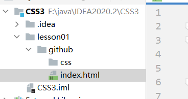

```html
<!DOCTYPE html>
<html lang="en">
<head>
    <meta charset="UTF-8">
    <title>CSS3快速入门</title>
    <!-- 规范:<style>可以编写CSS的代码，每一个声明最好以“;”结尾
            语法:
                选择器{
                    声明1;
                    声明2;
                    声明3;
                }
    -->
    <style>
        h1{
            color: blue;
        }
    </style>
</head>
<body>

<h1>CSS3测试</h1>

</body>
</html>
```


- 建议使用这种规范（单独写一个css文件，用link标签引入css文件效果） 。


> CSS的优势：
>
> - 内容和表现分离；
> - 网页结构表现统一，可以实现复用；
> - 样式十分的丰富；
> - 建议使用独立于html的css文件；
> - 利用SEO，容易被搜索引擎收录！ 

> CSS的3种常用导入方式。

```html
<!DOCTYPE html>
<html lang="en">
<head>
    <meta charset="UTF-8">
    <title>CSS3快速入门</title>
    <!--外部样式-->
    <link rel="stylesheet" href="css/style.css">

    <style>
        <!--内部样式-->
        h1{
            color: blue;
        }
    </style>
</head>
<body>
<!--优先级:就近原则——行内样式 > 内部样式 > 外部样式-->
<!--行内样式:在标签元素中，编写一个style属性，编写样式即可-->
<h1 style="color: aquamarine">CSS3测试</h1>

</body>
</html>
```


- 拓展：外部样式两种方法。

  - 链接式——HTML

    ```html
    	<!--外部样式-->
        <link rel="stylesheet" href="css/style.css">
    ```

  - 导入式—— @import是CSS2.1特有的！

    ```html
    	<!--导入式-->
        <style>
            @import url("css/style.css");
        </style>
    ```

## 2.CSS选择器

- 作用：选择页面上的某一个后者某一类元素。

### 1.基本选择器

> 1. 标签选择器——选择一类标签。
>    - 格式：标签名{}

```html
<!DOCTYPE html>
<html lang="en">
<head>
    <meta charset="UTF-8">
    <title>标签</title>
    <style>
        h1{
            color: orange;
            background: beige;
            border-radius: 10px;
        }
        h3{
            color: aquamarine;
            background: chocolate;
            border-radius: 10px;
        }
        p{
            font-size: 80px;
        }
    </style>
</head>
<body>

<h1>标签选择器</h1>
<p>Android</p>
<h3>前端-CSS3</h3>

</body>
</html>
```


> 2. 类选择器class——选择所有class一致的标签，跨标签。
>    - 格式：.类名{}

```html
<!DOCTYPE html>
<html lang="en">
<head>
    <meta charset="UTF-8">
    <title>类选择器</title>
    <style>
        /*
        类选择器的格式: .class的名称{}
        好处:可以多个标签归类,是同一个class,可以复用！
         */
        .test01{
            color: darkorange;
        }
        .test02{
            color: cadetblue;
        }
        .test03{
            color: cornflowerblue;
        }
    </style>
</head>
<body>

<h1 class="test01">类选择器:Test01</h1>
<h1 class="test02">类选择器:Test02</h1>
<h1 class="test03">类选择器:Test03</h1>
<p class="test03">类选择器:Test04</p>

</body>
</html>
```

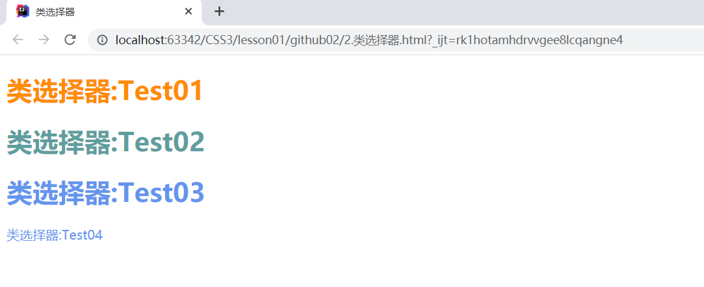

> 3. id选择器——全局唯一
>    - 格式：#id名{}

```html
<!DOCTYPE html>
<html lang="en">
<head>
    <meta charset="UTF-8">
    <title>Title</title>
    <style>
        /*
        id选择器: id必须保证全局唯一
        #id名称{}
        不遵循就近原则,优先级是固定的
        id选择器 > class类选择器 > 标签选择器
         */
        #git02{
            color: darkorange;
        }
        #git03{
            color: cadetblue;
        }
        #git01{
            color: cornflowerblue;
        }
        h1{
            color: darkseagreen;
        }
    </style>
</head>
<body>

<h1 id="git01" class="git02">id选择器:git01</h1>
<h1 id="git02" class="git02">id选择器:git02</h1>
<h1 class="git03">id选择器:git03</h1>
<h1 id="git03" class="git01">id选择器:git01</h1>
<h1>id选择器:git03</h1>

</body>
</html>
```

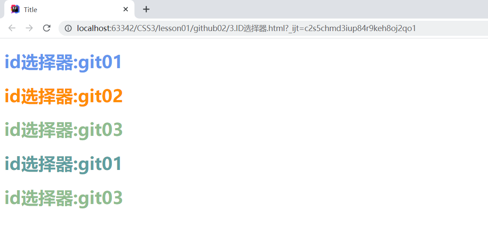

- 优先级：id > class > 标签。

### 2.层次选择器

> - 后代选择器：在某个元素的后面。
> - 子选择器：一代。
> - 相邻的兄弟选择器：同辈。
> - 通用选择器。

```html
<!DOCTYPE html>
<html lang="en">
<head>
    <meta charset="UTF-8">
    <title>Title</title>
    <style>
        /*
        后代选择器
         */
        body p{
            background: deeppink;
        }
        /*
        子选择器
         */
        body>p{
            background: olive;
        }
        /*
        相邻兄弟选择器:只选择一个,相邻向下
         */
        .active+p{
            background: blueviolet;
        }
    </style>
</head>
<body>

<p>后代选择器p1</p>
<p class="active">子选择器p2</p>
<p>相邻兄弟选择器p3</p>

</body>
</html>
```


```html
<!DOCTYPE html>
<html lang="en">
<head>
    <meta charset="UTF-8">
    <title>Title</title>
    <style>
        /*
        后代选择器
         */
        body p{
            background: deeppink;
        }
        /*
        子选择器
         */
        /*body>p{*/
        /*    background: olive;*/
        /*}*/
        /*
        相邻兄弟选择器:只选择一个,相邻向下
         */
        .active+p{
            background: blueviolet;
        }
    </style>
</head>
<body>

<p>后代选择器p1</p>
<p class="active">子选择器p2</p>
<p>相邻兄弟选择器p3</p>

</body>
</html>
```


```html
<!DOCTYPE html>
<html lang="en">
<head>
    <meta charset="UTF-8">
    <title>Title</title>
    <style>
        /*
        后代选择器
         */
        body p{
            background: deeppink;
        }
        /*
        子选择器
         */
        /*body>p{*/
        /*    background: olive;*/
        /*}*/
        /*
        相邻兄弟选择器:只选择一个,相邻向下
         */
        .active+p{
            background: blueviolet;
        }
        /*
        通用兄弟选择器，当前选中元素的向下的所有兄弟元素
         */
        .active2~p{
            background: dodgerblue;
        }
    </style>
</head>
<body>

<p>后代选择器p1</p>
<p class="active">子选择器p2</p>
<p>相邻兄弟选择器p3</p>
<p class="active2">通用兄弟选择器p4</p>
<p>通用兄弟选择器p5</p>

</body>
</html>
```


### 3.结构伪类选择器

> - 伪类

```html
<!DOCTYPE html>
<html lang="en">
<head>
    <meta charset="UTF-8">
    <title>伪类选择器</title>
    <style>
        ul li:first-child{
            /*
            ul的第一个子元素
            */
            background: mediumaquamarine;
        }
        ul li:last-child{
            /*
            ul的最后一个子元素
            */
            background: lightpink;
        }
        /*
        选中p1:定位到父元素,选择当前的第一个元素
            选择当前P元素的父级元素，选中父级元素的第一个，并且是当前元素才生效！
         */
        p:nth-child(1){
            background: greenyellow;
        }
        p:nth-of-type(2){
            /*
            选中父元素下的第二个p元素
            */
            background: lightseagreen;
        }
        a:hover{
            color: royalblue;
        }
    </style>
</head>
<body>

<a href="">9521</a>
<p>p1</p>
<p>p2</p>
<p>p3</p>
<h3>h3</h3>
<ul>
    <li>1li01</li>
    <li>1li02</li>
    <li>1li03</li>
    <li>1li04</li>
</ul>
<ul>
    <li>2li01</li>
    <li>2li02</li>
    <li>2li03</li>
    <li>2li04</li>
</ul>
<a href="https://www.taobao.com/">淘宝</a>

</body>
</html>
```


### 4.属性选择器(常用)

> - id + class 结合

```html
<!DOCTYPE html>
<html lang="en">
<head>
    <meta charset="UTF-8">
    <title>属性选择器</title>
    <style>
        .demo a{
            float: left;
            display: block;
            height: 50px;
            width: 50px;
            border-radius: 10px;
            background: aquamarine;
            text-align: center;
            color: gray;
            text-decoration: none;
            margin-right: 5px;
            line-height:50px;
            font: bold 20px/50px Arial;
        }
        /*
        属性名,属性名 = 属性值（正则）
              = 表示绝对等于
             *= 表示包含
             ^= 表示以...开头
             $= 表示以...结尾
             存在id属性的元素
                a[]{}
         */
        a[id]{
            background: deeppink;
        }
        a[id=first]{
            /*
            id=first的元素
            */
            background: greenyellow;
        }

        a[class*="links"]{
            /*
            class 中有links的元素
            */
            background: green;
        }

        a[href^=http]{
            /*
            选中href中以http开头的元素
            */
            background: aquamarine;
        }
        a[href$=pdf]{
            /*
            选中href中以http开头的元素
            */
            background: aquamarine;
        }
    </style>
</head>
<body>

<p class="demo">
    <a href="https://www.taobao.com/" class="links item first" id="first">淘宝</a>
    <a href="" class="links item active" target="_blank " title="test">链接</a>
    <a href="img/hello.html" class="links item">网页</a>
    <a href="img/str1.png" class="links item">png</a>
    <a href="img/str2.jpg" class="links item">jpg</a>
    <a href="abc" class="links item">链2</a>
    <a href="/fy.pdf" class="links item">pdf</a>
    <a href="/quit.pdf" class="links item">pdf2</a>
    <a href="dump.doc" class="links item">doc</a>
    <a href="kiko.doc" class="links item last">doc2</a>
</p>

</body>
</html>
```


## 3.美化网页

### 1.为什么要美化网页

1. 有效的传递页面信息
2. 美化网页，页面漂亮才能吸引客户
3. 凸显页面的主题
4. 提高用户的体验

**span标签**：重点要突出的字，使用span标签套起来

```html
<!DOCTYPE html>
<html lang="en">
<head>
    <meta charset="UTF-8">
    <title>美化网页</title>
    <style>
        #title{
            font-size: 25px;
        }
    </style>
</head>
<body>

编程语言:<span id="title">Java</span>

</body>
</html>
```


### 2.字体样式

- font-family：字体
- font-size：字体大小
- font-weight：字体粗细
- color：字体颜色

```html
<!DOCTYPE html>
<html lang="en">
<head>
    <meta charset="UTF-8">
    <title>Title</title>
    <style>
        body{
            font-family: "Arial Black";
            color: dodgerblue;
        }
        h1{
            font-size: 25px;
        }
        .p1{
            font-weight: 600;
            color: chocolate;
        }
    </style>
</head>
<body>

<h1>标题</h1>
<p>正文6699</p>
<p class="p1">正文4444444</p>
<p>Study English and Computer</p>

</body>
</html>
```

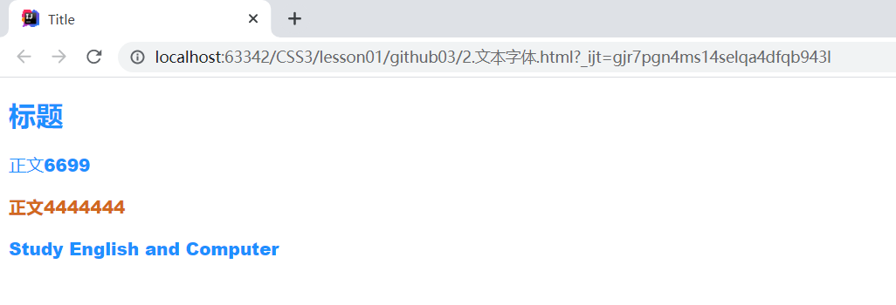

- 常用写法。

```css
/* 也可以填px，但不能超过900,相当于bloder */
font-weight:bolder;
/*常用写法：*/
font:oblique bloder 12px "楷体"
```

### 3.文本样式

- 颜色–>color:agb / rgba()
- 文本对齐方式–>text-align：center;
- 首行缩进–>text-indent：2em;
- 行高–>line-height：300px;
- 下划线–>text-decoration;

```css
/*下划线*/
text-decoration:underline
/*中划线*/
text-decoration:line-through
/*上划线*/
text-decoration:overline
/*超链接去下划线*/
text-decoration:none
```

```html
<!DOCTYPE html>
<html lang="en">
<head>
    <meta charset="UTF-8">
    <title>Title</title>
    <style>
        h1{
            color: rgba(0,255,255,0.9);
            text-align: center;
        }
        .p1{
            text-indent:2em;

        }
        .p3{
            line-height:300px;
            background: mediumaquamarine;
            height: 300px;
        }
        /*下划线*/
        .l1{
            text-decoration: underline;
        }
        /*中划线*/
        .l2{
            text-decoration: line-through;
        }
        /*上划线*/
        .l3{
            text-decoration: overline;
        }
        /*超链接去下划线*/
        a{
            text-decoration: none;
        }
    </style>
</head>
<body>

<a href="">4399-7k7k</a>

<p class="l1">123123123</p>
<p class="l2">123123123</p>
<p class="l3">123123123</p>

<h1>概述</h1>
<p class="p1">
    夸克一词是盖尔曼取自詹姆斯·乔伊斯的小说《芬尼根的守灵夜》的词句“向麦克老人三呼夸克（Three quarks for Muster Mark）”。无非是指一个质子中有三个夸克。另外夸克在该书中具有多种含义，其
    中之一是一种海鸟的叫声。他认为，这适合他最初认为“基本粒子不基本、基本电荷非整数”的奇特想法，同时他也指出这只是一个笑话，这是对矫饰的科学语言的反抗。另外，也可能是出于他对鸟类的喜爱。 [7]
    盖尔曼原本想用鸭的叫声来命名夸克。开始时他并不太确定自己这个新词的实际拼法，直到他在詹姆斯·乔伊斯小说《芬尼根守灵夜》里面找到“夸克”这个词

</p>
<p>
    在1963年，我把核子的基本构成命名为“夸克”（quark），我先有的是声音，而没有拼法，所以当时也可以写成“郭克”（kwork）。不久之后，在我偶尔翻阅詹姆斯·乔伊斯所著的《芬尼根守灵夜》时，我在“向麦克老大三呼夸克”这句中看到夸克这个词。由于“夸克”（字面上意为海鸥的叫声）很明显是要跟“麦克”及其他这样的词押韵，所以我要找个借口让它读起来像“郭克”。但是书中代表的是酒馆老板伊厄威克的梦，词源多是同时有好几种。书中的词很多时候是酒馆点酒用的词。所以我认为或许“向麦克老大三呼夸克”源头可能是“敬麦克老大三个夸脱”，那么我要它读“郭克”也不是完全没根据。再怎么样，字句里的三跟自然中夸克的性质完全不谋而合。
</p>
<p class="p3">
    茨威格则用“埃斯”（Ace）来称呼他所理论化的粒子，但是在夸克模型被广泛接纳时，盖尔曼的用词就变得很有名。很多中国物理学家则称夸克为“层子”，在台湾地区亦曾翻译“亏子”，但并不普遍使用。
</p>


</body>
</html>
```

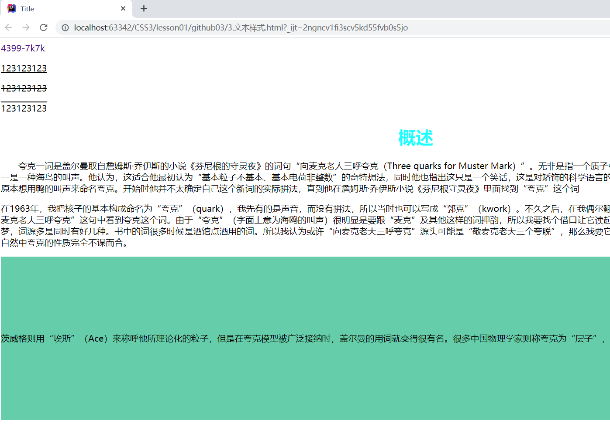

- 图片、文字水平对齐。

```css
img,span{
    vertical-align: middle;
}
```

### 4.文本阴影和超链接伪类

```html
<!DOCTYPE html>
<html lang="en">
<head>
    <meta charset="UTF-8">
    <title>Title</title>
    <style>
        /*超链接有默认的颜色*/
        a{
            text-decoration: hotpink;
            color: #000000;
        }
        /*鼠标悬浮的状态*/
        a:hover{
            color: dodgerblue;
        }
        /*鼠标按住未释放的状态*/
        a:active{
            color:green
        }
        /*点击之后的状态*/
        a:visited{
            color:mediumpurple;
        }
        /*
            text-shadow:5px 5px 5px 颜色

            第一个参数：表示水平偏移
	        第二个参数：表示垂直偏移
	        第三个参数：表示模糊半径
	        第四个参数：表示颜色
        */
        #price{
            text-shadow: #eaff29 5px 5px 5px;
        }
        /*固定阴影*/
        a:link{
            background: bisque;
        }
    </style>
</head>
<body>

<a href="#">
    
</a>
<p>
    <a href="#">Java博客</a>
</p>
<p id="price">
    <a href="#">哇哈哈</a>
</p>

</body>
</html>
```

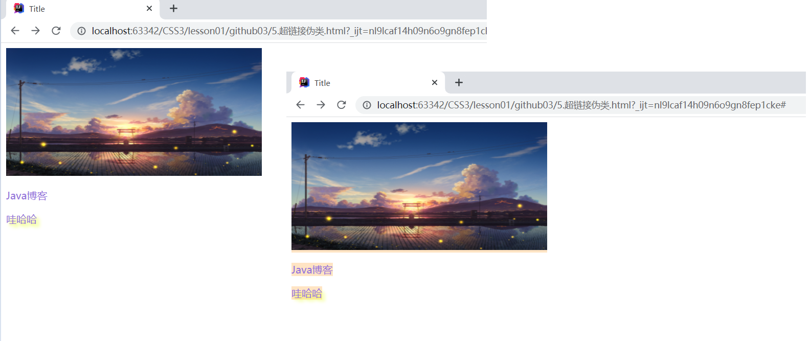

### 5.列表ul、li

```html
<!DOCTYPE html>
<html lang="en">
<head>
    <meta charset="UTF-8">
    <title>Title</title>
    <link href="css/style.css" rel="stylesheet" type="text/css">
    <style>

    </style>
</head>
<body>
<div id="nav">
    <h2 class="title">全部商品分类</h2>
    <ul>
        <li>
            <a href="#">图书</a>
            <a href="#">影视</a>
            <a href="#">家电</a>
        </li>
        <li>
            <a href="#">配件</a>
            <a href="#">手机</a>
            <a href="#">数码</a>
        </li>
        <li>
            <a href="#">电脑</a>
            <a href="#">办公</a>
        </li>
        <li>
            <a href="#">家居</a>
            <a href="#">家装</a>
            <a href="#">厨具</a>
        </li>
        <li>
            <a href="#">服饰鞋帽</a>
            <a href="#">个性化妆</a>
        </li>
        <li>
            <a href="#">礼品箱包</a>
            <a href="#">钟表</a>
            <a href="#">珠宝</a>
        </li>
        <li>
            <a href="#">食品饮料</a>
            <a href="#">保健食品</a>
        </li>
        <li>
            <a href="#">彩票</a>
            <a href="#">旅行</a>
            <a href="#">充值</a>
            <a href="#">票务</a>
        </li>
    </ul>
</div>
</body>
</html>
```

- CSS规则。

```css
#nav{
    width: 300px;
    background: beige;
}
.title{
    font-size: 18px;
    font-weight: bold;
    text-indent: 2em;/*缩进*/
    line-height: 35px;
    background: gold;
}
/*ul li*/
/*
list-style:
    non 去掉实心圆
    circle 空心圆
    square 正方形
*/
/*nav替换效果*/
/*ul{
    background: antiquewhite;
}*/
ul li{
    height: 30px;
    list-style: none;
    text-indent: 1em;
}
a{
    text-decoration: none;
    font-size: 14px;
    color: darkorange;
}
a:hover{
    color: dodgerblue;
    text-decoration: underline;
}
```


### 6.背景

- 背景颜色：background

- 背景图片。

  ```css
  background-image:url(""); /* 默认是全部平铺的 */
  background-repeat:repeat-x; /* 水平平铺 */
  background-repeat:repeat-y; /* 垂直平铺 */
  background-repeat:no-repeat; /* 不平铺 */
  ```

```html
<!DOCTYPE html>
<html lang="en">
<head>
    <meta charset="UTF-8">
    <title>背景</title>
    <style>
        div{
            width: 500px;
            height: 200px;
            border: 1px solid mediumaquamarine;
            background-image: url("img/str.png");
            /* 默认是全部平铺的 */
        }
        /*水平平铺*/
        .div1{
            background-repeat: repeat-x;
        }
        /*垂直平铺*/
        .div2{
            background-repeat: repeat-y;
        }
        /*不平铺*/
        .div3{
            background-repeat: no-repeat;
        }
    </style>
</head>
<body>

<div class="div1"></div>
<div class="div2"></div>
<div class="div3"></div>

</body>
</html>
```


### 7.渐变

- 渐变背景网址：[https://www.grabient.com](https://www.grabient.com)
- 径向渐变、圆形渐变。

```css
body{
     background-color: #0cd7f3;
     background-image: linear-gradient(43deg, #0093E9 0%, #80D0C7 46%, #23F549 100%);
}
```

```html
<!DOCTYPE html>
<html lang="en">
<head>
    <meta charset="UTF-8">
    <title>背景</title>
    <style>
       body{
            background-color: #08AEEA;
            background-image: linear-gradient(0deg, #08AEEA 0%, #2AF598 100%);
        }
        div{
            width: 500px;
            height: 200px;
            border: 1px solid mediumaquamarine;
            background-image: url("img/str.png");
            /* 默认是全部平铺的 */
        }
        /*水平平铺*/
        .div1{
            background-repeat: repeat-x;
        }
        /*垂直平铺*/
        .div2{
            background-repeat: repeat-y;
        }
        /*不平铺*/
        .div3{
            background-repeat: no-repeat;
        }
    </style>
</head>
<body>

<div class="div1"></div>
<div class="div2"></div>
<div class="div3"></div>

</body>
</html>
```

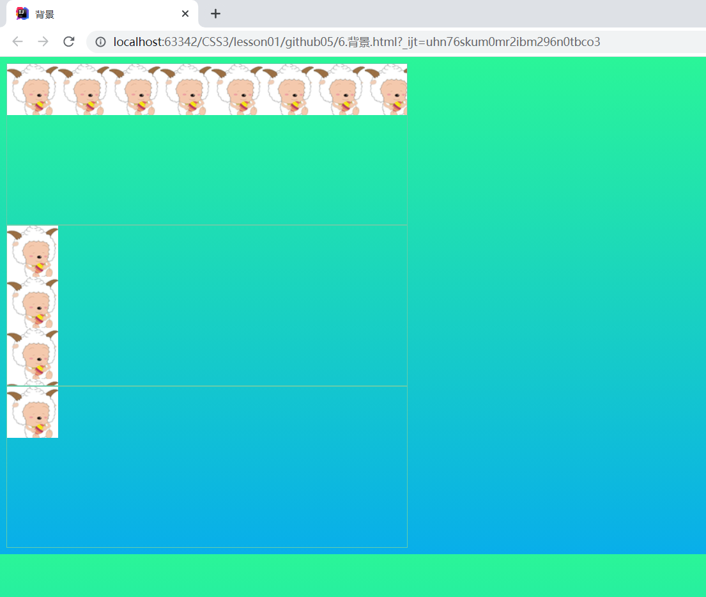

## 4.盒子模型

### 1.什么是盒子模型

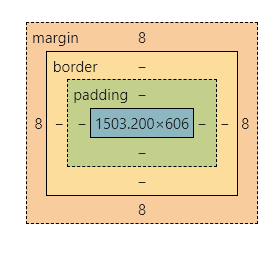

- margin：外边距；
- padding：内边框；
- border：边框；

### 2.边框

- border：粗细 样式 颜色
  - 边框的粗细；
  - 边框的样式；
  - 边框的颜色。
  
- html空格代码

  | 名称      | 描述                      |
  | --------- | ------------------------- |
  | &nbsp ;   | 不断行的空白(1个字符宽度) |
  | &ensp ;   | 半个空白(1字符宽度)       |
  | &emsp ;   | 一个空白(2个字符宽度)     |
  | &thinsp ; | 窄空白(小于1个字符宽度)   |

```html
<!DOCTYPE html>
<html lang="en">
<head>
    <meta charset="UTF-8">
    <title>盒子</title>
    <style>
        /*body总有一个默认的外边距为0*/
        /*h1,ul,li,a,body{*/
        /*    margin: 0;*/
        /*    padding: 0;*/
        /*    text-decoration: none;*/
        /*}*/
        /*border：粗细 样式 颜色*/
        #box{
            width: 300px;
            border: 1px solid peru;
        }
        h2{
            font-size: 16px;
            background-color: antiquewhite;
            line-height: 30px;
            margin: 0;
            color: hotpink;

        }
        form{
            background: khaki;
        }
        div:nth-of-type(1) input{
            border: 3px solid seagreen;
        }
        div:nth-of-type(2) input{
            border: 3px dashed gray;
        }
        div:nth-of-type(3) input{
            border: 2px solid royalblue;
        }
    </style>
</head>
<body>

<div id="box">
    <h2>会员登陆</h2>
    <form action="#">
        <div>
            <span>用户名:</span>
            <input type="text">
        </div>
        <div>
            <span>密&emsp;码:</span>
            <input type="text">
        </div>
        <div>
            <span>邮&emsp;箱:</span>
            <input type="text">
        </div>
    </form>
</div>

</body>
</html>
```

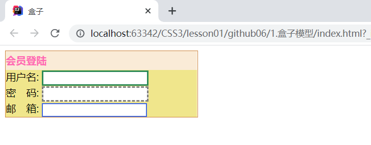

### 3.外边距

- margin-left/right/top/bottom–>表示四边，可分别设置，也可以同时设置如下 .

```css
/* 分别表示上、右、下、左；从上开始顺时针 */
margin:0 0 0 0 
/* 例1: 居中 auto表示左右自动 */
margin:0 auto 
/* 例2：表示上、右、下、左都为4px */
margin:4px 
/* 例3: 表示上为10px，左右为20px，下为30px */
margin:10px 20px 30px 
```

```html
<!DOCTYPE html>
<html lang="en">
<head>
    <meta charset="UTF-8">
    <title>外边距</title>
    <style>
        #box{
            width: 300px;
            border: 1px solid peru;
            margin: 0 auto;
        }
        h2{
            font-size: 16px;
            background-color: antiquewhite;
            line-height: 30px;
            margin: 0;
            color: hotpink;
        }
        form{
            background: khaki;
        }
        input{
            border: 1px solid tomato;
        }
        div:nth-of-type(1){
            padding: 10px; /* 内边距10px */
        }
    </style>
</head>
<body>

<div id="box">
    <h2>会员登陆</h2>
    <form action="#">
        <div>
            <span>用户名:</span>
            <input type="text">
        </div>
        <div>
            <span>密&emsp;码:</span>
            <input type="text">
        </div>
        <div>
            <span>邮&emsp;箱:</span>
            <input type="text">
        </div>
    </form>
</div>

</body>
</html>
```


- 盒子的计算方式：
  - margin+border+padding+内容的大小。
- 总结：
  - body总有一个默认的外边距 margin:0
  - 常见操作：初始化。

### 4.圆角边框

```css
<!DOCTYPE html>
<html lang="en">
<head>
    <meta charset="UTF-8">
    <title>边框</title>
    <style>
        div{
            width: 100px;
            height: 100px;
            border: 10px solid mediumpurple;
            /* 一个border-radius只管一个圆的1/4 */
            border-radius: 50px 20px 20px 30px;
            /* 左上 右上 右下 左下 ,顺时针方向 */
        }
    </style>
</head>
<body>

<div></div>

</body>
</html>
```


```html
<!DOCTYPE html>
<html lang="en">
<head>
    <meta charset="UTF-8">
    <title>头像</title>
    <style>
        img{
            border-radius: 25px; /*圆角矩形25px*/
            width: 64px;
            height: 64px;
        }
    </style>
</head>
<body>


</body>
</html>
```


### 5.盒子阴影

```css
box-shodow:10px 10px 1px black;
```

```html
<!DOCTYPE html>
<html lang="en">
<head>
    <meta charset="UTF-8">
    <title>边框</title>
    <style>
        div{
            width: 100px;
            height: 100px;
            border: 10px solid mediumpurple;
            /* 一个border-radius只管一个圆的1/4 */
            border-radius: 50px 20px 20px 30px;
            /* 左上 右上 右下 左下 ,顺时针方向 */
        }
        #box{
            box-shadow: 10px 10px 1px black;
        }
    </style>
</head>
<body>

<div id="box"></div>

</body>
</html>
```


## 5.浮动

### 1.标准文档流

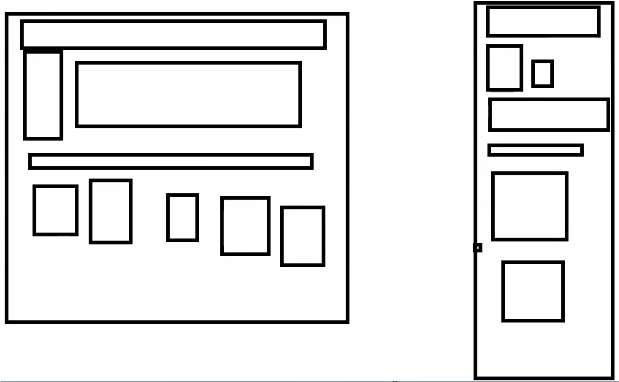

- 块级元素：独占一行 

```css
h1~h6 、p、div、 列表…
```

- 行内元素：不独占一行 

```css
span、a、img、strong
```

- 注： 行内元素可以包含在块级元素中，反之则不可以。

### 2.dispaly

- block：块元素；
- inline：行内元素；
- inline-block：是块元素，但是可以内联，在一行；
- 这也是一种实现行内元素排列的方式，但是我们很多情况用float。 

```html
<!DOCTYPE html>
<html lang="en">
<head>
    <meta charset="UTF-8">
    <title>dispaly</title>
    <style>
        /*
        block: 块元素
        inline: 行内元素
        inline-block: 块元素，但是可以内联
        none: 隐藏
        */
        div{
            width: 100px;
            height: 100px;
            border: 1px solid darkorange;
            display: inline-block;
        }
        span{
            width: 100px;
            height: 100px;
            border: 1px solid darkorange;
            display: inline-block;
        }
    </style>
</head>
<body>

<div>div块元素</div>
<span>span行内元素</span>

</body>
</html>
```


### 3.float:left/right

- clear: both

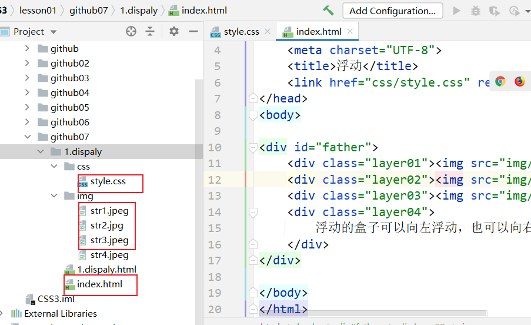

```html
<!DOCTYPE html>
<html lang="en">
<head>
    <meta charset="UTF-8">
    <title>浮动</title>
    <link href="css/style.css" rel="stylesheet" type="text/css">
</head>
<body>

<div id="father">
    <div class="layer01"></div>
    <div class="layer02"></div>
    <div class="layer03"></div>
    <div class="layer04">
        浮动的盒子可以向左浮动，也可以向右浮动，知道他的外边缘碰到包含框或另一个浮动盒子为止。
    </div>
</div>

</body>
</html>
```

```css
div{
    margin: 10px;
    padding: 5px;
}
#father{
    border: 1px #000 solid;
}
.layer01{
    border: 1px #F00 dashed;
    display: inline-block;
    float: left;
}
.layer02{
    border: 1px #00F dashed;
    display: inline-block;
    float: right;
}
.layer03{
    border: 1px #060 dashed;
    display: inline-block;
}
.layer04{
    border: 1px #666 dashed;
    font-size: 12px;
    line-height: 23px;
    display: inline-block;
    clear: both;
}
```


### 4.父级边框塌陷的问题

- clear：
  - right：右侧不允许有浮动元素；
  - left：左侧不允许有浮动元素；
  - both：两侧不允许有浮动元素；
  - none：
  
- 解决塌陷问题方案：
  - 方案一：增加父级元素的高度；
  
  ```css
  #father{
      border:1px #000 solid;
      height:800px;
  }
  ```
  
  - 方案二：增加一个空的div标签，清除浮动。

```html
<div class = "clear"></div>

<style>
    .clear{
        clear:both;
        margin:0;
        padding:0;
    }
</style>
```

- 方案三：在父级元素中增加一个overflow属性。

```css
    overflow:hidden; /* 隐藏超出部分 */
    overflow:scroll; /* 滚动 */
```

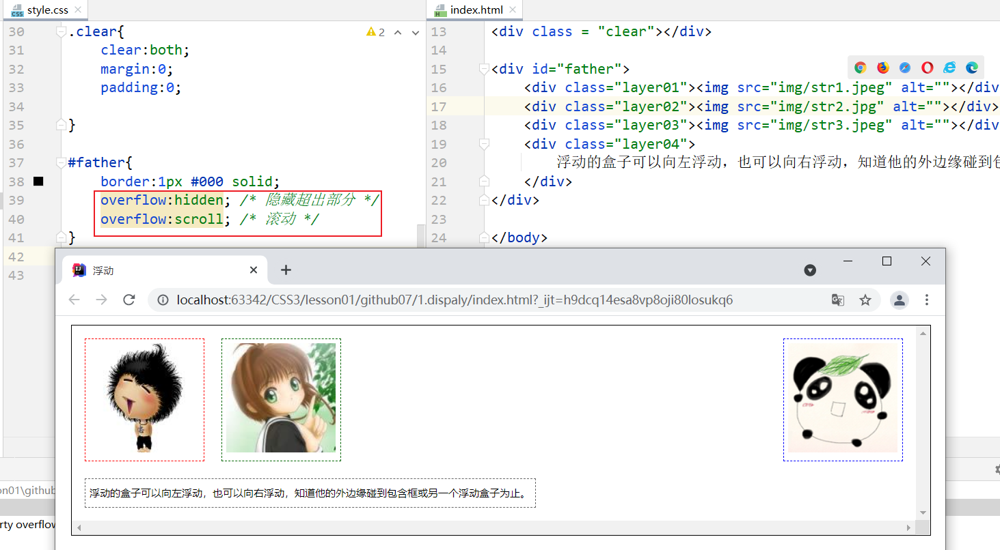

- 方案四：父类添加一个伪类:after。

```css
#father:after{
    content:'';
    display:block;
    clear:both;
}
```

- 小结：

  - 浮动元素增加空div----> 简单、代码尽量避免空div；
  - 设置父元素的高度-----> 简单，但是元素假设有了固定的高度，可能就会超出范围；
  - overflow----> 简单，下拉的一些场景避免使用；
  - 父类添加一个伪类:after（推荐）----> 写法稍微复杂，但是没有副作用，推荐使；

  > display与float对比：

  - display：方向不可以控制；
  - float：浮动起来的话会脱离标准文档流，所以要解决父级边框塌陷的问题。。

## 6.定位

### 1.相对定位

- 相对定位：positon：relstive；
- 相对于原来的位置，进行指定的偏移，相对定位的话，它仍然在标准文档流中！原来的位置会被保留。

```css
top:-20px; /* 向上偏移20px */
left:20px; /* 向右偏移20px */
bottom:10px; /* 向上偏移10px */
right:20px; /* 向左偏移20px */
```

- 案例

```html
<!DOCTYPE html>
<html lang="en">
<head>
    <meta charset="UTF-8">
    <title>路径</title>
    <style>
        /* 相对路径: 相对于自己原来的位置进行偏移 */
        body{
            padding: 20px;
        }
        div{
            margin: 10px;
            padding: 5px;
            font-size: 12px;
            line-height: 25px;
        }
        #father{
            border: #6646f3 1px solid;
            padding: 0;
        }
        #first{
            border: #ff38f5 1px solid;
            background-color: #e83970;
            position: relative; /* 相对定位：上下左右*/
            top: -20px; /* 向上偏移20px */
            left: 20px; /* 向右偏移20px */
        }
        #second{
            border: #3ad518 1px solid;
            background-color: #08e0fc;
        }
        #third{
            background-color: #5075f8;
            border: #fcb346 1px solid;
            position: relative;
            bottom: 10px;   /* 向上偏移10px */
        }
    </style>
</head>
<body>

<div id="father">
    <div id="first">第一个盒子</div>
    <div id="second">第二个盒子</div>
    <div id="third">第三个盒子</div>
</div>

</body>
</html>
```

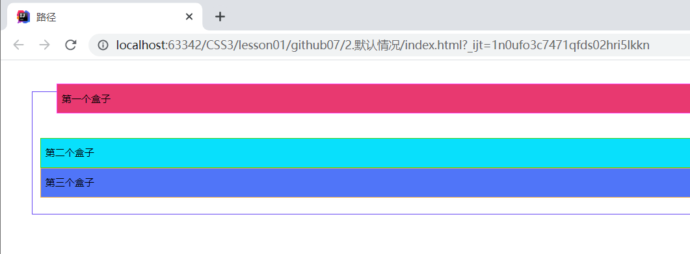

- 练习

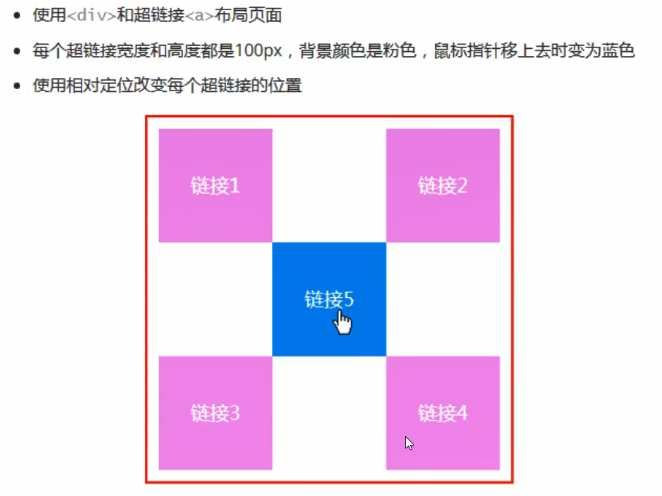

```html
<!DOCTYPE html>
<html lang="en">
<head>
    <meta charset="UTF-8">
    <title>练习</title>
    <style>
        #box{
            height: 300px;
            width: 300px;
            border: 2px red solid;
            padding: 10px;
        }
        a{
            height: 100px;
            width: 100px;
            background-color: #ee73b7;
            color: white;
            text-align: center;
            text-decoration: none;
            line-height: 100px; /* 设置行距100px */
            display: block; /* 设置方块 */
        }
        a:hover{
            background: #4158D0;
        }
        .a2,.a4{
            position: relative;
            left: 200px;
            top: -100px;
        }
        .a5{
            position: relative;
            left: 100px;
            top: -300px;
        }
    </style>
</head>
<body>

<div id="box">
    <div class="a1"><a href="#">连接1</a></div>
    <div class="a2"><a href="#">连接2</a></div>
    <div class="a3"><a href="#">连接3</a></div>
    <div class="a4"><a href="#">连接4</a></div>
    <div class="a5"><a href="#">连接5</a></div>
</div>

</body>
</html>
```

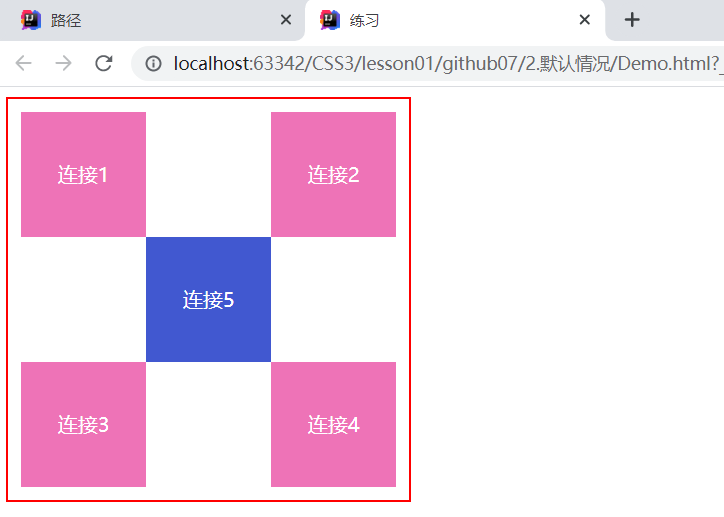

### 2.绝对定位与固定定位

- 定位：基于xxx定位，上下左右；
  1. 没有父级元素定位的前提下，相对于浏览器定位；
  2. 假设父级元素存在定位，我们通常会相对于父级元素进行偏移；
  3. 在父级元素范围内移动。
- 总结：相对一父级或浏览器的位置，进行指定的偏移，绝对定位的话，它不在标准文档流中，原来的位置不会被保留。

```html
<!DOCTYPE html>
<html lang="en">
<head>
    <meta charset="UTF-8">
    <title>绝对定位</title>
    <style>
        body{
            height: 1000px;
        }
        div:nth-of-type(1){
            width: 600px;
            height: 600px;
            background-color: #4a77d4;
            position: absolute; /* absolute 绝对定位 */
            right: 0;
            bottom: 0;
        }
        div:nth-of-type(2){
            width: 400px;
            height: 400px;
            background-color: #fcb346;
            position: fixed; /* fixed 固定定位 */
            right: 0;
            bottom: 0;
        }
    </style>
</head>
<body>

<div>div1</div>
<div>div2</div>

</body>
</html>
```

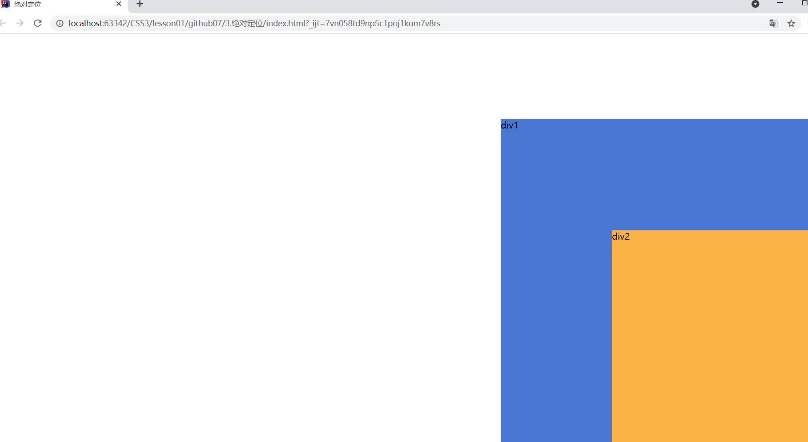

### 3.z-index及透明度


- 图层-z-index：默认是0，最高无限~999。 

```html
<!DOCTYPE html>
<html lang="en">
<head>
    <meta charset="UTF-8">
    <title>透明度</title>
    <link rel="stylesheet" href="css/style.css" type="text/css">
    <style>

    </style>
</head>
<body>

<div id="content">
    <ul>
        <li></li>
        <li class="tipText">Java后端学习</li>
        <li class="tipBg"></li>
        <li>时间:1202-06-15</li>
        <li>地点:水星基地核心仓</li>
    </ul>
</div>

</body>
</html>
```

- CSS源码

```css
#content{
    width: 450px;
    padding: 0px;
    margin: 0px;
    overflow: hidden;
    font-size: 12px;
    line-height: 25px;
    border: 1px solid #1079f6;
}
ul,li{
    padding: 0px;
    margin: 0px;
    list-style: none;
}
/* 父级元素相对定位 */
#content ul{
    position: relative;
}
.tipText,.tipBg{
    position: absolute;
    width: 380px;
    height: 25px;
    top:216px
}
.tipText{
    color: #ffffff;
    z-index: 999;
}
.tipBg{
    background: #33f13d;
    opacity: 0.5; /* 背景透明度 */
    filter: alpha(opacity=50);
}
```

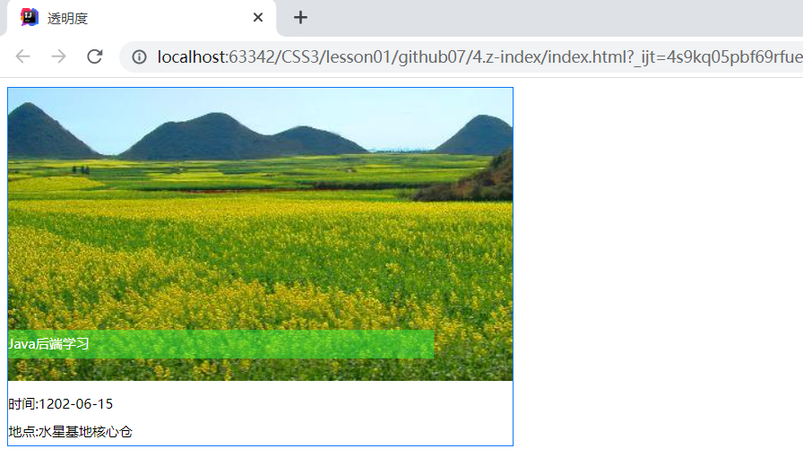

## 7.网页动画

- css做动画过于繁琐，已有很多工具间接性做出；
- 百度搜索[canvas动画](https://www.html5tricks.com/tag/html5-canvas/)、[卡巴斯基监控站](https://cybermap.kaspersky.com/cn)（仅作了解）。

- 案例

```html
<!doctype html>
<html>
<head>
    <meta charset="utf-8">
    <title>HTML5 Canvas模拟飞机航班线路动画DEMO演示</title>

    <style>
        *{margin:0;padding:0;}
        canvas {
            background:#111;
            background-size:cover;
            display:block;
        }
        body{overflow: hidden;}
    </style>

</head>
<body>

<div></div>

<script>

    window.requestAnimFrame=function(){return window.requestAnimationFrame||window.webkitRequestAnimationFrame||window.mozRequestAnimationFrame||function(a){window.setTimeout(a,1E3/60)}}();

    $ = {};

    $.util = {
        rand: function( min, max ) {
            return Math.random() * ( max - min ) + min;
        },
        randInt: function( min, max ) {
            return Math.floor( Math.random() * ( max - min + 1 ) ) + min;
        },
        norm: function( val, min, max ) {
            return ( val - min ) / ( max - min );
        },
        lerp: function( norm, min, max ) {
            return ( max - min ) * norm + min;
        },
        map: function( val, sMin, sMax, dMin, dMax ) {
            return $.util.lerp( $.util.norm( val, sMin, sMax), dMin, dMax );
        },
        clamp: function( val, min, max ) {
            return Math.min( Math.max( val, Math.min( min, max ) ), Math.max( min, max ) );
        },
        distance: function( p1, p2 ) {
            var dx = p1.x - p2.x,
                dy = p1.y - p2.y;
            return Math.sqrt( dx * dx + dy * dy );
        },
        angle: function( p1, p2 ) {
            return Math.atan2( p1.y - p2.y, p1.x - p2.x );
        },
        inRange: function( val, min, max ) {
            return val >= Math.min( min, max ) && val <= Math.max( min, max );
        },
        pointInRect: function( x, y, rect ) {
            return $.util.inRange( x, rect.x, rect.x + rect.width ) &&
                $.util.inRange( y, rect.y, rect.y + rect.height );
        },
        pointInArc: function( p, a ) {
            return distance( p, a ) <= a.radius;
        },
        setProps: function( obj, props ) {
            for( var k in props ) {
                obj[ k ] = props[ k ];
            }
        },
        multicurve: function( points, ctx ) {
            var p0, p1, midx, midy;
            ctx.moveTo(points[0].x, points[0].y);
            for(var i = 1; i < points.length - 2; i += 1) {
                p0 = points[i];
                p1 = points[i + 1];
                midx = (p0.x + p1.x) / 2;
                midy = (p0.y + p1.y) / 2;
                ctx.quadraticCurveTo(p0.x, p0.y, midx, midy);
            }
            p0 = points[points.length - 2];
            p1 = points[points.length - 1];
            ctx.quadraticCurveTo(p0.x, p0.y, p1.x, p1.y);
        }
    };

    $.init = function() {
        // setup
        $.c = document.createElement( 'canvas' );
        $.ctx = $.c.getContext( '2d' );
        document.body.appendChild( $.c );

        // collections
        $.ports = [];
        $.planes = [];

        // events
        window.addEventListener( 'resize', $.reset, false );
        window.addEventListener( 'click', $.reset, false );
        $.reset();
        $.step();
    };

    $.reset = function() {
        // dimensions
        $.cw = $.c.width = window.innerWidth;
        $.ch = $.c.height = window.innerHeight;
        $.dimAvg = ( $.cw + $.ch ) / 2;

        // type / font
        $.ctx.textAlign = 'center';
        $.ctx.textBaseline = 'middle';
        $.ctx.font = '16px monospace';

        // options / settings
        $.opt = {};
        $.opt.portCount = 6;
        $.opt.planeCount = 80;
        $.opt.portSpacingDist = $.dimAvg / $.opt.portCount;
        $.opt.holdingDist = 5;
        $.opt.approachDist = 80;
        $.opt.planeDist = 20;
        $.opt.pathSpacing = 15;
        $.opt.pathCount = 40;
        $.opt.avoidRadius = 30;
        $.opt.avoidMult = 0.025;

        // collections
        $.ports.length = 0;
        $.planes.length = 0;

        // delta
        $.lt = Date.now();
        $.dt = 1;
        $.et = 0;
        $.tick = 0;

        // setup ports
        for( var i = 0; i < $.opt.portCount; i++ ) {
            $.ports.push( new $.Port() );
        }

        // setup planes
        for( var i = 0; i < $.opt.planeCount; i++ ) {
            $.planes.push( new $.Plane() );
        }
    };

    $.Port = function() {
        this.x = $.util.rand( $.cw * 0.1, $.cw * 0.9 );
        this.y = $.util.rand( $.ch * 0.1, $.ch * 0.9 );
        while( !this.validSpacing() ) {
            this.x = $.util.rand( $.cw * 0.1, $.cw * 0.9 );
            this.y = $.util.rand( $.ch * 0.1, $.ch * 0.9 );
        }
    };

    $.Port.prototype.validSpacing = function() {
        var spaced = true,
            i = $.ports.length;
        while( i-- ) {
            var otherPort = $.ports[ i ];
            if( $.util.distance( otherPort, this ) < $.opt.portSpacingDist ) {
                spaced = false;
                break;
            }
        }
        return spaced;
    };

    $.Port.prototype.update = function( i ) {
        var j = $.planes.length;
        this.approachingCount = 0;
        while( j-- ) {
            var plane = $.planes[ j ];
            if( plane.destIndex == i && plane.approaching ) {
                this.approachingCount++;
            }
        }
    };

    $.Port.prototype.render = function( i ) {
        $.ctx.beginPath();
        $.ctx.arc( this.x, this.y, 3 + ( this.approachingCount + 5 ), 0, Math.PI * 2 );
        $.ctx.fillStyle = 'hsla(120, 90%, 80%, ' + ( 0.35 + Math.sin( $.et / 20 ) * 0.2 ) + ')';
        $.ctx.fill();

        $.ctx.fillStyle = '#fff';
        $.ctx.fillText( this.approachingCount, this.x, this.y - 30 );
    };

    $.Plane = function( opt ) {
        this.originIndex = $.util.randInt( 0, $.ports.length - 1 );
        this.origin = $.ports[ this.originIndex ];
        this.path = [];
        this.x = this.origin.x;
        this.y = this.origin.y;
        this.vx = $.util.rand( -0.35, 0.35 );
        this.vy = $.util.rand( -0.35, 0.35 );
        this.vmax = 1;
        this.accel = 0.01;
        this.decel = 0.96;
        this.angle = 0;
        this.approaching = false;
        this.holding = false;
        this.setDest();
    };

    $.Plane.prototype.setDest = function() {
        if( this.destIndex != undefined ) {
            this.originIndex = this.destIndex;
            this.origin = $.ports[ this.originIndex ];
        }
        this.destIndex = $.util.randInt( 0, $.ports.length - 1 );
        while( this.destIndex == this.originIndex ) {
            this.destIndex = $.util.randInt( 0, $.ports.length - 1 );
        }
        this.dest = $.ports[ this.destIndex ];
        this.approaching = false;
        this.holding = false;
    }

    $.Plane.prototype.update = function( i ) {
        this.ox = this.x;
        this.oy = this.y;
        if( $.tick % $.opt.pathSpacing == 0 ) {
            this.path.push( { x: this.x, y: this.y } );
        }
        if( this.path.length > $.opt.pathCount ) {
            this.path.shift();
        }

        this.angle = $.util.angle( this.dest, this );
        this.speed = ( Math.abs( this.vx ) + Math.abs( this.vy ) ) / 2;

        if( !$.util.pointInRect( this.x, this.y, { x: 0, y: 0, width: $.cw, height: $.ch } ) ) {
            this.vx *= this.decel;
            this.vy *= this.decel;
        }

        if( this.speed > 0.1 ) {
            if( $.util.distance( this.dest, this ) < $.opt.approachDist ) {
                this.vx *= this.decel;
                this.vy *= this.decel;
                this.approaching = true;
            }
        }

        if( $.util.distance( this.dest, this ) < $.opt.holdingDist ) {
            this.holding = true;
            this.setDest();
        }

        this.vx += Math.cos( this.angle ) * this.accel;
        this.vy += Math.sin( this.angle ) * this.accel;
        if( this.speed > this.vmax ) {
            this.vx *= this.decel;
            this.vy *= this.decel;
        }

        this.x += this.vx * $.dt;
        this.y += this.vy * $.dt;
    };

    $.Plane.prototype.render = function( i ) {
        if( this.approaching ) {
            $.ctx.strokeStyle = 'hsla(0, 80%, 50%, 1)';
        } else {
            $.ctx.strokeStyle = 'hsla(180, 80%, 50%, 1)';
        }

        $.ctx.beginPath();
        $.ctx.moveTo( this.x, this.y );
        var angle = $.util.angle( { x: this.ox, y: this.oy }, this );
        $.ctx.lineWidth = 2;
        $.ctx.lineTo(
            this.x - Math.cos( angle ) * ( 3 + this.speed * 2 ),
            this.y - Math.sin( angle ) * ( 3 + this.speed * 2 )
        );
        $.ctx.stroke();

        var pathLength = this.path.length;
        if( pathLength > 1) {
            $.ctx.strokeStyle = 'hsla(0, 0%, 100%, 0.15)';
            $.ctx.lineWidth = 1;
            $.ctx.beginPath();

            if( pathLength >= $.opt.pathCount ) {
                var angle = $.util.angle( this.path[ 1 ], this.path[ 0 ] ),
                    dx = this.path[ 0 ].x - this.path[ 1 ].x,
                    dy = this.path[ 0 ].y - this.path[ 1 ].y,
                    dist = Math.sqrt( dx * dx + dy * dy ),
                    x = this.path[ 0 ].x + Math.cos( angle ) * ( dist * ( ( $.tick % $.opt.pathSpacing ) / $.opt.pathSpacing ) ),
                    y = this.path[ 0 ].y + Math.sin( angle ) * ( dist * ( ( $.tick % $.opt.pathSpacing ) / $.opt.pathSpacing ) );
            } else {
                var x = this.path[ 0 ].x,
                    y = this.path[ 0 ].y
            }

            $.ctx.moveTo( x, y );
            for( var i = 1; i < pathLength; i++ ) {
                var point = this.path[ i ];
                $.ctx.lineTo( point.x, point.y );
            }
            $.ctx.lineTo( this.x, this.y );
            $.ctx.stroke();
        }
    };

    $.step = function() {
        requestAnimFrame( $.step );

        // clear
        $.ctx.globalCompositeOperation = 'destination-out';
        $.ctx.fillStyle = 'hsla(0, 0%, 0%, 1)';
        $.ctx.fillRect( 0, 0, $.cw, $.ch );
        $.ctx.globalCompositeOperation = 'lighter';

        // collections
        var i;
        i = $.ports.length; while( i-- ) { $.ports[ i ].update( i ) }
        i = $.planes.length; while( i-- ) { $.planes[ i ].update( i ) }
        i = $.ports.length; while( i-- ) { $.ports[ i ].render( i ) }
        i = $.planes.length; while( i-- ) { $.planes[ i ].render( i ) }

        // delta
        var now = Date.now();
        $.dt = $.util.clamp( ( now - $.lt ) / ( 1000 / 60 ), 0.001, 10 );
        $.lt = now;
        $.et += $.dt;
        $.tick++;
    };

    $.init();
</script>

</body>
</html>
```


## 8.总结


