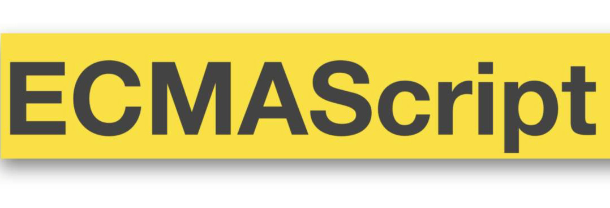

​    JavaScript是世界上发展最快的编程语言之一，不仅可以用于编写运行在浏览器的客户端程序，随着Node.js的发展，JavaScript也被广泛应用于编写服务端程序。而随着JavaScript这门语言的不断发展和完善，在2015年正式发布的ECMAScript6（2015）已经成为了JavaScript这门语言的下一代标准，使得JavaScript用来编写复杂的大型应用程序更加的得心应手。近几年几乎所有使用JavaScript这门语言开发的项目，都在使用ES的新特性来开发。

​    随着ES2015的发布，标准委员会决定在每年都会发布一个ES的新版本。但很多开发者并没有真正的理解ES2015+每个版本都具有哪些新特性，以及这些新特性与ES5语法的差别，更不清楚这些新特性在实际项目中的应用场景是怎么样的。而市面上虽然有很多关于ES新特性的帖子或者教学视频，但普遍不够系统，有些新特性归纳不够完整，有些没有新旧语法的对比无法完整的体现出新语法的优势，更多的只是告诉学习者语法应该如何使用但没有说清楚新特性在项目中的应用场景，这就使得学习者始终有一种纸上谈兵的感觉，语法可能虽然学会了但在实际项目的开发中却有些“力不从心”。

​    本门课程详细讲解了ES2015~ES2020每一个版本所引入的新特性，结合ES5对比讲解ES新特性充分体现新特性语法优势，更重要的是给学习者讲解清楚新语法的应用场景，并且本课程理论与实践相结合，在课程第八章以Vue框架为例，讲解ES新特性在实战项目中的应用。

本课程受众人群：

1. 技术小白，接触前端不久，学习了JavaScript一些基础的语法，但发现在网上看一些技术贴或者开源项目的时候，很多语法根本看不懂
2. 前端求职者，打算成为一名真正的前端开发工程师，但面试过程中每次都会被问到一个问题：“你对ES新特性掌握多少”，每次遇到这样的问题都有些力不从心
3. 初入职场的菜鸟，已经学了一段时间前端开发正打算在公司里大展拳脚，却发现公司大牛们写的很多语法根本看不懂，甚至一度怀疑自己“难道我之前学习的是假的JavaScript”
4. 技能党，喜欢追求最新的语法、最炫酷的技术，时刻走在技术的最前沿，励志做一名技术的弄潮儿，想了解ES又出了哪些新的特性以及如何使用这些新特性在自己的项目中编写出炫酷的代码