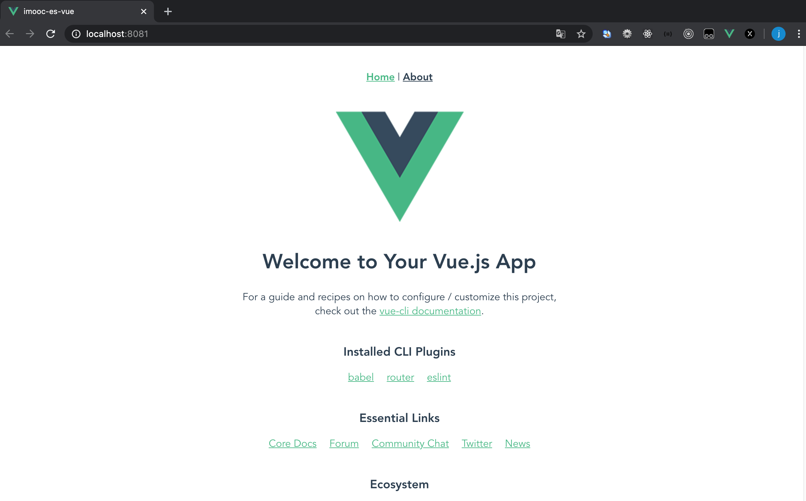

# 初始化环境

## Vue CLI环境安装

Vue CLI 是一个基于 Vue.js 进行快速开发的完整系统。

官方网站：https://cli.vuejs.org/zh/guide/

### 安装命令

TIP

安装Vue CLI需要在电脑中具有Node的开发环境。

Node 版本要求

Vue CLI 需要 Node.js 8.9 或更高版本 (推荐 8.11.0+)。

Windows：

```sh
npm install -g @vue/cli@4.3.1
```

Mac：

```sh
sudo npm install -g @vue/cli@4.3.1
```

安装完成，在终端输入：

```sh
vue -V  

或  

vue --version
```

TIP

本课程使用版本：V4.3.1

## 初始化项目

### 创建项目

```sh
vue create imooc-es-vue
```

TIP

命令中的 `imooc-es-vue` 表示项目名称，大家可以根据自己的喜好来起名字，但名称中不要带有中文哦。


 

 

 

 

 

 

### 进入项目

```sh
cd imooc-es-vue
```

### 运行项目

```sh
npm run serve
```

项目启动起来以后，大家可以在终端中看到项目的地址，然后在浏览器中打开这个地址。 


注意

截图中的地址是 `http://localhost:8081/` , 大家在自己项目中的端口号有可能会不一样，以大家的实际情况为准。

如果顺利看到这个页面，说明项目已经成功运行起来了。



## VSCode 插件

