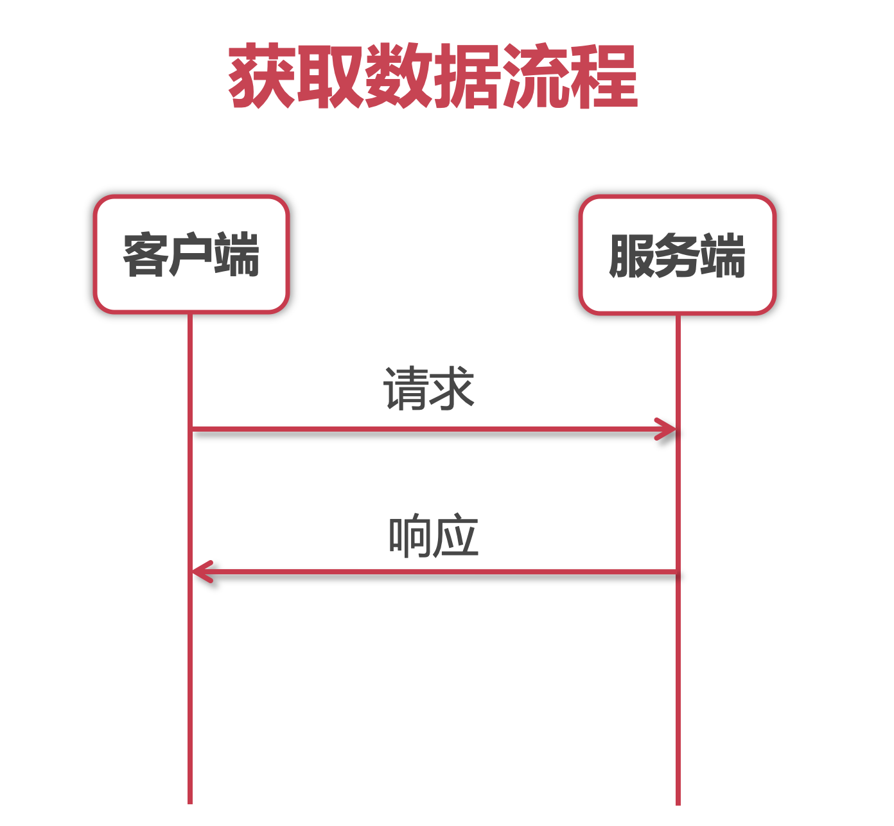
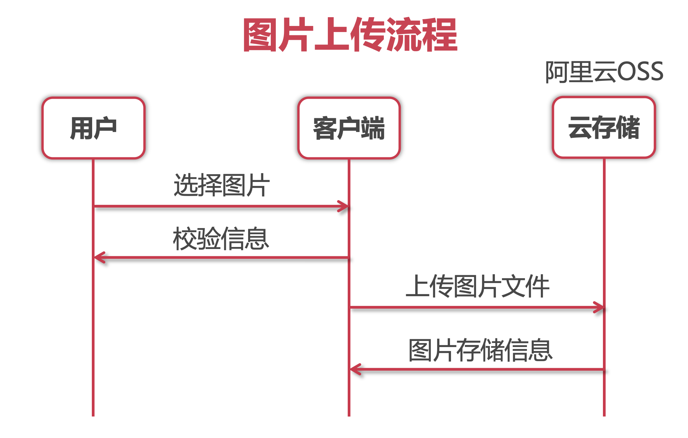

# 项目功能

## 获取用户信息列表

### 获取数据流程



在views文件夹中创建User.vue文件。

安装axios

```sh
npm i axios --save
<template>
  <div>
    <div>用户信息</div>
    <ul>
      <li v-for="(item, index) in userList" :key="index">{{item.name}}</li>
    </ul>
  </div>
</template>

<script>
// 模块化
import axios from 'axios'
export default {
  data () {
    return {
      userList: []
    }
  },
  // Promise方式实现
  /*   created () {
      axios
        .get('http://jsonplaceholder.typicode.com/users')
        .then(res => {
          console.log(res)
          this.userList = res.data
        })
        .catch(err => {
          console.log(err)
        })
    } */

  // async/await方式实现
  async created () {
    // 解构赋值
    const { data } = await axios.get('http://jsonplaceholder.typicode.com/users')
    this.userList = data
  }
}
</script>

<style>
li {
    list-style: none;
}
ul{
    padding: 0;
}
</style>
```

在router/index.js中配置路由。

```js
import User from '../views/User.vue'

const routes = [{
    path: '/',
    name: 'User',
    component: User
}]
```

在App.vue中配置链接。

```html
<router-link to="/">用户列表</router-link>
```

## 使用Proxy代理用户信息

```vue
<template>
  <div>
    <div>用户信息</div>
    <button @click="asc">升序</button>
    <button @click="desc">降序</button>
    <button @click="reset">重置</button>
    <ul>
      <li v-for="(item, index) in userList" :key="index">{{item.name}}</li>
    </ul>
  </div>
</template>

<script>
import axios from 'axios'
export default {
  data () {
    return {
      userList: []
    }
  },
  //   created () {
  //     axios
  //       .get('http://jsonplaceholder.typicode.com/users')
  //       .then(res => {
  //         console.log(res)
  //         this.userList = res.data
  //       })
  //       .catch(err => {
  //         console.log(err)
  //       })
  //   }
  async created () {
    // 解构赋值
    const { data } = await axios.get('http://jsonplaceholder.typicode.com/users')
    // 代理
    this.proxy = new Proxy({}, {
      get (target, key) {
        if (key === 'asc') { // 升序
          return [].concat(data).sort((a, b) => a.name > b.name ? 1 : -1)
        } else if (key === 'desc') { // 降序
          return [].concat(data).sort((a, b) => b.name > a.name ? 1 : -1)
        } else {
          return data
        }
      },
      set () {
        return false
      }
    })
    this.userList = this.proxy.default
  },
  methods: {
    asc () {
      this.userList = this.proxy.asc
    },
    desc () {
      this.userList = this.proxy.desc
    },
    reset () {
      this.userList = this.proxy.default
    }
  }
}
</script>

<style>
li {
    list-style: none;
}
ul{
    padding: 0;
}
</style>
```

## 异步操作多张图片上传阿里云OSS

图片上传流程图：



在views文件夹中创建Upload.vue文件。

安装ali-oss:

```sh
npm i ali-oss --save
<template>
  <div>

    <label for="upload" class="choose-img" :class="{upLoading: isUploading}">选择图片上传</label>
    <input type="file" multiple id="upload"
    style="display: none;" accept="image/*"
    @change="onChange" ref="file" :disabled="isUploading"
    >
    <p class="tip">提示：一次可选择多张图片，最多不超过9张（单张图片大小 &lt; 1M）</p>
    <ul class="img-container">
        <li v-for="(item, index) in imgList" :key="index"
        :style="{background: `url(${item}) no-repeat center/contain` }"
        ></li>
    </ul>

  </div>
</template>

<script>
import OSS from 'ali-oss'
const ACCESSKEY = {
  ID: '请填写自己的accessKeyId', 
  SECRET: '请填写自己的accessKeySecret'
}
export default {
  data () {

    return {
      client: new OSS({
        region: 'oss-cn-beijing',
        bucket: 'imooc-es',
        accessKeyId: ACCESSKEY.ID,
        accessKeySecret: ACCESSKEY.SECRET
      }),
      imgList: [], // 存放上传完成的图片的列表
      isUploading: false // 当前图片是否正在上传
    }

  }, 
  methods: {

    onChange () {
      // 可选链
      const newFiles = this.$refs?.file?.files
      // 校验
      if (newFiles.length > 9) {
        alert('最多可以一次选择9张图片')
        return false
      }
      const files = []
      for (const file of newFiles) {
        const size = file.size / 1024 / 1024 // 把单位转化成M
        if (size > 1) {
          alert('请选择1M以内的图片')
          return false
        }
        files.push(file)
      }
      this.uploadFilesByOSS2(files)
    },
    // 上传多图到阿里云OSS
    uploadFilesByOSS (files) {
      this.isUploading = true
      const uploadRequest = []
      for (const file of files) {
        uploadRequest.push(new Promise((resolve, reject) => {
          this.client.put( `${Math.random()}-${file.name}` , file).then(res => {
            // console.log(res)
            // this.imgList = [...this.imgList, res.url]
            resolve(res.url)
          }).catch(err => {
            console.log(err)
            reject(err)
          })
        }))
      }
      Promise.allSettled(uploadRequest).then(res => {
        console.log(res)
        const imgs = []
        for (const item of res) {
          if (item.status === 'fulfilled') {
            imgs.push(item.value)
          }
        }
        this.imgList = imgs
        this.isUploading = false
      }).catch(err => {
        console.log(err)
      })
    },
    // async / await
    async uploadFilesByOSS2 (files) {
      this.isUploading = true
      const imgs = []
      for (const file of files) {
        const result = await this.client.put( `${Math.random()}-${file.name}` , file)
        imgs.push(result.url)
      }
      this.imgList = imgs
      this.isUploading = false
    }

  }
}
</script>

<style scoped>
.choose-img {

    display: block;
    width: 150px;
    height: 50px;
    text-align: center;
    line-height: 50px;
    background-color: #42b983;
    color: #fff;
    border-radius: 5px;
    cursor: pointer;

}
.tip {

    color: #ccc;

}

.img-container > li{

    list-style: none;
    width: 150px; 
    height: 100px; 
    float: left; 
    margin: 0 30px 30px 0; 
    border: 1px solid #ccc; 

}

.upLoading{

    background-color: #ccc;

}
</style>
```

## 组件按需加载

在router/index.js中对组件实现按需加载。

```js
const routes = [
  {
    path: '/',
    name: 'User',
    component: User
  }, {
    path: '/upload',
    name: 'Upload',
    component: () => import('../views/Upload.vue')
  }
]
```