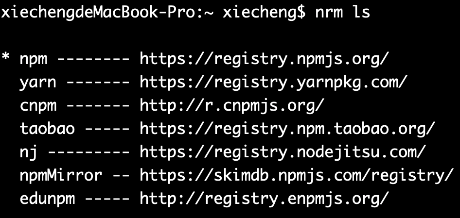
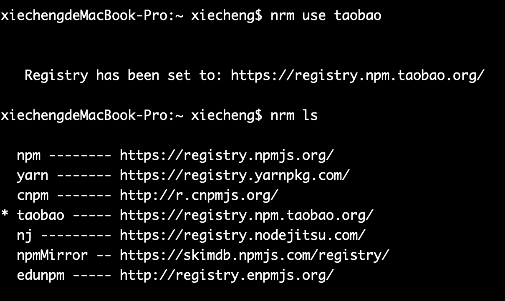

NRM(Npm Registry Manager )是npm的镜像源管理工具，有时候国外资源太慢，可以使用就可以快速地在 npm 源间切换。

TIP

NRM 不是必装工具，如果网络环境比较好可以不安装，并不影响课程学习。

### 安装

在命令行执行命令，全局安装nrm

Windows电脑安装命令：

```sh
npm install -g nrm
```

Mac电脑安装命令：

```sh
sudo npm install -g nrm
```

### 使用

执行命令查看可选的源：

```sh
nrm ls
```



其中，带*的是当前使用的源，上面的输出表明当前源是官方源。

### 切换

如果要切换到taobao源，执行命令

```sh
nrm use taobao
```



### 测速

```sh
nrm test npm
```