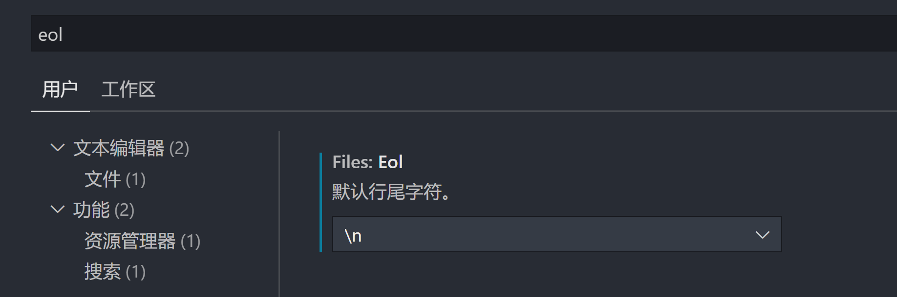

:::tip

这里是文档的一些初始化信息

:::


- 官方文档：[安装 | Docusaurus](https://docusaurus.io/zh-CN/docs/installation)
- 这里是表情符号词典 [📓 | EmojiAll 中文官方网站](https://www.emojiall.com/zh-hans)
- [主题初衷与诞生 | vuepress-theme-vdoing](https://doc.xugaoyi.com/pages/52d5c3/#markdown)
- 搜索插件：[easyops-cn/docusaurus-search-local: Offline/local search for Docusaurus v2](https://github.com/easyops-cn/docusaurus-search-local)
  - 代码示例：[easyops-cn/docusaurus-search-example: An example for @easyops-cn/docusaurus-search-local](https://github.com/easyops-cn/docusaurus-search-example)
  - 居中效果样例：[Blog | docusaurus-plugin-image-zoom](https://gabrielcsapo.github.io/docusaurus-plugin-image-zoom/blog/)
- 图片插件：
  - [flexanalytics/plugin-image-zoom](https://github.com/flexanalytics/plugin-image-zoom)
  - [react-zmage | 一个基于 React 的可缩放图片控件](https://zmage.caldis.me/)
  - 【推荐】[flexanalytics/plugin-image-zoom](https://github.com/flexanalytics/plugin-image-zoom)
- icon 主题插画：[iconma - iconfont-阿里巴巴矢量图标库](https://www.iconfont.cn/user/detail?spm=a313x.7781069.1998910419.d9bd4f23f&uid=9747490&nid=I8SI6mOR8vTm)
- 在线插画下载：
  - [Search | unDraw](https://undraw.co/search)
  - [Storyset | Customize, animate and download illustration for free](https://storyset.com/)
  - [Sapiens Character Builder by UI8.net](https://sapiens.ui8.net/6f3c3c2)
  - [Free Icons, Clipart Illustrations, Photos, and Music](https://icons8.com/)

- [dingyusong/docusaurus_edit_by_typora](https://github.com/dingyusong/docusaurus_edit_by_typora)


## 部署说明

- [部署 | Docusaurus](https://docusaurus.io/zh-CN/docs/deployment#triggering-deployment-with-github-actions)
- [docusaurus 搭建博客，利用 GitHub Actions 自动部署 GitHub Pages - 掘金](https://juejin.cn/post/6936846407051509774)
- 参考站点：
  - yingwinwin/yingwinwin.github.io
    - 仓库：[yingwinwin/yingwinwin.github.io: 一个前端菜鸟的自我救赎之路...](https://github.com/yingwinwin/yingwinwin.github.io)
    - 在线预览：[yingwinwin.github.io/](https://yingwinwin.github.io/)


## 注意事项

### Docusaurus  CRLF to LF

- **问题描述**

markdown h1 header render error on windows and macos · Issue #7120 · facebook/docusaurus
https://github.com/facebook/docusaurus/issues/7120

- **问题原因**

  Git 在维护版本库的时候统一使用的是 LF，这样就可以保证文件跨平台的时候保持一致。
  在 Linux 下默认的换行符是 LF。
  在 Windows 下默认的换行符是 CRLF，需要保证在文件提交到版本库的时候文件的换行符是 LF。

- **解决方案**

  You should change all your CRLF to LF for the time being. In vs code the config is at the bottom right.

  ```shell
  # 查看配置
  git config --global core.autocrlf
  # 设置 crlf 为 false
  git config --global core.autocrlf false
  ```

  设置 vscode 默认换行为 `\n`（即：LF）：文件 → 首选项 → 设置

  

- **参考链接**

  - [Windows 将 CRLF 格式转换为 LF 格式（vscode）_七侠剑客的博客-程序员宅基地_crlf 转 lf - 程序员宅基地](https://www.cxyzjd.com/article/qq_36727756/105164225)
  - [vscode 如何替换所有文件的回车格式为 LF 呢？ - H5W3](https://www.h5w3.com/188967.html)
  - [vscode 解决 windows 换行 crlf 与 lf 冲突 - 代码先锋网](https://www.codeleading.com/article/28155040906/)
  - [vscode 解决 windows 换行 CRLF 与 LF 冲突 - 掘金](https://juejin.cn/post/7050347374840905736)
