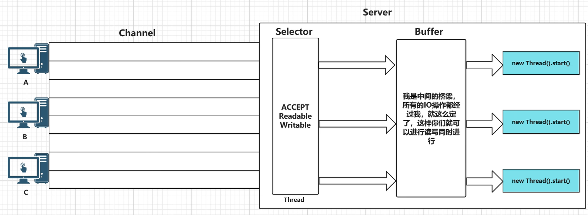

# Java IO

Java 的 I/O 大概可以分成以下几类：

- 磁盘操作：File
- 字节操作：InputStream 和 OutputStream
- 字符操作：Reader 和 Writer
- 对象操作：Serializable
- 网络操作：Socket
- 新的输入/输出：NIO


### 1、磁盘操作（File）

File 类可以用于表示文件和目录的信息，但是它不表示文件的内容。

递归地输出一个目录下所有文件：

```java
public static void listAllFiles(File dir)
{
    if (dir == null || !dir.exists()) {
        return;
    }
    if (dir.isFile()) {
        System.out.println(dir.getName());
        return;
    }
    for (File file : dir.listFiles()) {
        listAllFiles(file);
    }
}
```


### 2、字节操作（*Stream）

使用字节流操作进行文件复制：

```java
public static void copyFile(String src, String dist) throws IOException
{
    FileInputStream in = new FileInputStream(src);
    FileOutputStream out = new FileOutputStream(dist);
    byte[] buffer = new byte[20 * 1024];
    // read() 最多读取 buffer.length 个字节
    // 返回的是实际读取的个数
    // 返回 -1 的时候表示读到 eof，即文件尾
    while (in.read(buffer, 0, buffer.length) != -1) {
        out.write(buffer);
    }
    in.close();
    out.close();
}
```


<div align="center">  </div><br/>


Java I/O 使用了**装饰者模式**来实现。以 InputStream 为例，InputStream 是抽象组件，FileInputStream 是 InputStream 的子类，属于具体组件，提供了字节流的输入操作。FilterInputStream 属于抽象装饰者，装饰者用于装饰组件，为组件提供额外的功能，例如 BufferedInputStream 为 FileInputStream 提供缓存的功能。

实例化一个具有缓存功能的字节流对象时，只需要在 FileInputStream 对象上再套一层 BufferedInputStream 对象即可。

```java
FileInputStream fileInputStream = new FileInputStream(filePath);
BufferedInputStream bufferedInputStream = new BufferedInputStream(fileInputStream);
```

DataInputStream 装饰者提供了对更多数据类型进行输入的操作，比如 int、double 等基本类型。


### 3、字符操作（*Reader | *Writer）

不管是磁盘还是网络传输，最小的存储单元都是字节，而不是字符。**但是在程序中操作的通常是字符形式的数据，因此需要提供对字符进行操作的方法。**

- InputStreamReader 实现从**字节流**解码成**字符流**；
- OutputStreamWriter 实现**字符流**编码成为**字节流**。

逐行输出文本文件的内容：

```java
public static void readFileContent(String filePath) throws IOException
{
    FileReader fileReader = new FileReader(filePath);
    BufferedReader bufferedReader = new BufferedReader(fileReader);
    String line;
    while ((line = bufferedReader.readLine()) != null) {
        System.out.println(line);
    }
    // 装饰者模式使得 BufferedReader 组合了一个 Reader 对象
    // 在调用 BufferedReader 的 close() 方法时会去调用 fileReader 的 close() 方法
    // 因此只要一个 close() 调用即可
    bufferedReader.close();
}
```

**编码**就是把字符转换为字节，而**解码**是把字节重新组合成字符。

如果编码和解码过程使用不同的编码方式那么就出现了乱码。

- GBK 编码中，中文字符占 2 个字节，英文字符占 1 个字节；
- UTF-8 编码中，中文字符占 3 个字节，英文字符占 1 个字节；
- UTF-16be 编码中，中文字符和英文字符都占 2 个字节。

UTF-16be 中的 be 指的是 Big Endian，也就是大端。相应地也有 UTF-16le，le 指的是 Little Endian，也就是小端。

Java 使用双字节编码 UTF-16be，这不是指 Java 只支持这一种编码方式，而是说 char 这种类型使用 UTF-16be 进行编码。char 类型占 16 位，也就是两个字节，Java 使用这种双字节编码是为了让一个中文或者一个英文都能使用一个 char 来存储。

String 可以看成一个字符序列，可以指定一个编码方式将它转换为字节序列，也可以指定一个编码方式将一个字节序列转换为 String。

```java
String str1 = "中文";
byte[] bytes = str1.getBytes("UTF-8");
String str2 = new String(bytes, "UTF-8");
System.out.println(str2);
```

在调用无参数 getBytes() 方法时，默认的编码方式不是 UTF-16be。双字节编码的好处是可以使用一个 char 存储中文和英文，而将 String 转为 bytes[] 字节数组就不再需要这个好处，因此也就不再需要双字节编码。getBytes() 的默认编码方式与平台有关，一般为 UTF-8。

```java
byte[] bytes = str1.getBytes();
```


### 4、Java序列化，如何实现序列化和反序列化，常见的序列化协议有哪些？ 

#### Java序列化定义 

（1）Java序列化是指把Java对象转换为字节序列的过程，而Java反序列化是指把字节序列恢复为Java对象的过程；

（2）**序列化**：对象序列化的最主要的用处就是在传递和保存对象的时候，保证对象的完整性和可传递性。序列化是把对象转换成有序字节流，以便在网络上传输或者保存在本地文件中。序列化后的字节流保存了Java对象的状态以及相关的描述信息。序列化机制的核心作用就是**对象状态的保存与重建**。

（3）**反序列化**：客户端从文件中或网络上获得序列化后的对象字节流后，根据字节流中所保存的对象状态及描述信息，通过反序列化重建对象。

（4）本质上讲，序列化就是把实体对象状态按照一定的格式写入到有序字节流，反序列化就是从有序字节流重建对象，恢复对象状态。

#### 如何实现序列化和反序列化，底层怎么实现

**1、JDK类库中序列化和反序列化API**

（1）java.io.ObjectOutputStream：表示对象输出流；

它的writeObject(Object obj)方法可以对参数指定的obj对象进行序列化，把得到的字节序列写到一个目标输出流中；

（2）java.io.ObjectInputStream：表示对象输入流；

它的readObject()方法源输入流中读取字节序列，再把它们反序列化成为一个对象，并将其返回；


**2、实现序列化的要求**

只有实现了 Serializable 或 Externalizable 接口的类的对象才能被序列化，否则抛出异常！


**3、实现Java对象序列化与反序列化的方法**

　　假定一个User类，它的对象需要序列化，可以有如下三种方法：

- 若 User 类仅仅实现了 Serializable 接口，则可以按照以下方式进行序列化和反序列化
  - ObjectOutputStream 采用默认的序列化方式，对 User 对象的非 transient 的实例变量进行序列化。
  - ObjcetInputStream 采用默认的反序列化方式，对对 User 对象的非 transient 的实例变量进行反序列化。
- 若User类仅仅实现了Serializable接口，并且还定义了 `readObject(ObjectInputStream in)` 和`writeObject(ObjectOutputSteam out)`，则采用以下方式进行序列化与反序列化。
  - ObjectOutputStream 调用 User 对象的 writeObject(ObjectOutputStream out) 的方法进行序列化。 
  - ObjectInputStream 会调用 User 对象的 readObject(ObjectInputStream in) 的方法进行反序列化。
- 若User类实现了 Externalnalizable 接口，且 User 类必须实现 `readExternal(ObjectInput in)` 和 `writeExternal(ObjectOutput out)` 方法，则按照以下方式进行序列化与反序列化。
  - ObjectOutputStream 调用 User 对象的 writeExternal(ObjectOutput out)) 的方法进行序列化。 
  - ObjectInputStream 会调用User对象的 readExternal(ObjectInput in) 的方法进行反序列化。


**4、JDK类库中序列化的步骤**

步骤一：创建一个对象输出流，它可以包装一个其它类型的目标输出流，如文件输出流：

```java
ObjectOutputStream oos = new ObjectOutputStream(new FileOutputStream("D:\\object.out"));
```

步骤二：通过对象输出流的writeObject()方法写对象：

```java
oos.writeObject(new User("xuliugen", "123456", "male"));
```


**5、JDK类库中反序列化的步骤**

步骤一：创建一个对象输入流，它可以包装一个其它类型输入流，如文件输入流：

```java
ObjectInputStream ois= new ObjectInputStream(new FileInputStream("object.out"));
```

步骤二：通过对象输出流的readObject()方法读取对象：

```java
User user = (User) ois.readObject();
```

说明：为了正确读取数据，完成反序列化，必须保证向对象输出流写对象的顺序与从对象输入流中读对象的顺序一致。


**6、序列化和反序列化的示例**

为了更好地理解Java序列化与反序列化，举一个简单的示例如下：

```java
public class SerialDemo {

    public static void main(String[] args) throws IOException, ClassNotFoundException {
        //序列化
        FileOutputStream fos = new FileOutputStream("object.out");
        ObjectOutputStream oos = new ObjectOutputStream(fos);
        User user1 = new User("xuliugen", "123456", "male");
        oos.writeObject(user1);
        oos.flush();
        oos.close();
        
        //反序列化
        FileInputStream fis = new FileInputStream("object.out");
        ObjectInputStream ois = new ObjectInputStream(fis);
        User user2 = (User) ois.readObject();
        System.out.println(user2.getUserName()+ " " + 
            user2.getPassword() + " " + user2.getSex());
        //反序列化的输出结果为：xuliugen 123456 male
    }
}

public class User implements Serializable {
    private String userName;
    private String password;
    private String sex;
    //全参构造方法、get和set方法省略
}
```


#### 相关注意事项

1、序列化时，只对对象的状态进行保存，而不管对象的方法；

2、当一个父类实现序列化，子类自动实现序列化，不需要显式实现 Serializable 接口；

3、当一个对象的实例变量引用其他对象，序列化该对象时也把引用对象进行序列化；

4、并非所有的对象都可以序列化，至于为什么不可以，有很多原因了，比如：

- 安全方面的原因，比如一个对象拥有private，public等field，对于一个要传输的对象，比如写到文件，或者进行RMI传输等等，在序列化进行传输的过程中，这个对象的private等域是不受保护的；
- 资源分配方面的原因，比如socket，thread类，如果可以序列化，进行传输或者保存，也无法对他们进行重新的资源分配，而且，也是没有必要这样实现；

5、声明为static和transient类型的成员数据不能被序列化。因为static代表类的状态，transient代表对象的临时数据。

6、序列化运行时使用一个称为 serialVersionUID 的版本号与每个可序列化类相关联，该序列号在反序列化过程中用于验证序列化对象的发送者和接收者是否为该对象加载了与序列化兼容的类。为它赋予明确的值。显式地定义serialVersionUID有两种用途：

- 在某些场合，希望类的不同版本对序列化兼容，因此需要确保类的不同版本具有相同的serialVersionUID；
- 在某些场合，不希望类的不同版本对序列化兼容，因此需要确保类的不同版本具有不同的serialVersionUID。

7、Java有很多基础类已经实现了serializable接口，比如String , Vector等。但是也有一些没有实现serializable接口的；

8、如果一个对象的成员变量是一个对象，那么这个对象的数据成员也会被保存！这是能用序列化解决深拷贝的重要原因；


**ArrayList 序列化和反序列化的实现** ：ArrayList 中存储数据的数组是用 transient 修饰的，因为这个数组是动态扩展的，并不是所有的空间都被使用，因此就不需要所有的内容都被序列化。通过重写序列化和反序列化方法，使得可以只序列化数组中有内容的那部分数据。

```java
private transient Object[] elementData;
```


参考资料：

- [序列化和反序列化的底层实现原理是什么？ - CSDN博客](https://blog.csdn.net/xlgen157387/article/details/79840134)


#### 常见的序列化协议有哪些 

- COM主要用于Windows平台，并没有真正实现跨平台，另外COM的序列化的原理利用了编译器中虚表，使得其学习成本巨大。 

- CORBA是早期比较好的实现了跨平台，跨语言的序列化协议。COBRA的主要问题是参与方过多带来的版本过多，版本之间兼容性较差，以及使用复杂晦涩。 

- XML & SOAP 

  - XML是一种常用的序列化和反序列化协议，具有跨机器，跨语言等优点。 
  - SOAP（Simple Object Access protocol） 是一种被广泛应用的，基于XML为序列化和反序列化协议的结构化消息传递协议。SOAP具有安全、可扩展、跨语言、跨平台并支持多种传输层协议。 

- JSON（JavaScript Object Notation） 

  - 这种Associative array格式非常符合工程师对对象的理解。 
  - 它保持了XML的人眼可读（Human-readable）的优点。 
  - 相对于XML而言，序列化后的数据更加简洁。  
  - 它具备javascript的先天性支持，所以被广泛应用于Web browser的应用常景中，是Ajax的事实标准协议。 
  - 与XML相比，其协议比较简单，解析速度比较快。 
  - 松散的Associative array使得其具有良好的可扩展性和兼容性。 

- Thrift是Facebook开源提供的一个高性能，轻量级RPC服务框架，其产生正是为了满足当前大数据量、分布式、跨语言、跨平台数据通讯的需求。Thrift在空间开销和解析性能上有了比较大的提升，对于对性能要求比较高的分布式系统，它是一个优秀的RPC解决方案；但是由于Thrift的序列化被嵌入到Thrift框架里面，Thrift框架本身并没有透出序列化和反序列化接口，这导致其很难和其他传输层协议共同使用 

- Protobuf具备了优秀的序列化协议的所需的众多典型特征 

  - 标准的IDL和IDL编译器，这使得其对工程师非常友好。 
  - 序列化数据非常简洁，紧凑，与XML相比，其序列化之后的数据量约为1/3到1/10。 
  - 解析速度非常快，比对应的XML快约20-100倍。 
  - 提供了非常友好的动态库，使用非常简介，反序列化只需要一行代码。由于其解析性能高，序列化后数据量相对少，非常适合应用层对象的持久化场景 

- Avro的产生解决了JSON的冗长和没有IDL的问题，Avro属于Apache Hadoop的一个子项目。 Avro提供两种序列化格式：JSON格式或者Binary格式。Binary格式在空间开销和解析性能方面可以和Protobuf媲美，JSON格式方便测试阶段的调试。适合于高性能的序列化服务。 

- **几种协议的对比** 

  - XML序列化（Xstream）无论在性能和简洁性上比较差； 
  - Thrift与Protobuf相比在时空开销方面都有一定的劣势； 
  - Protobuf和Avro在两方面表现都非常优越。 


### 5、同步和异步

同步IO：

- 读写IO时代码等数据返回后才继续执行后续代码
- 代码编写简单，CPU执行效率低
- JDK提供的java.io是同步IO

异步IO：

- 读写IO时仅发出请求，然后立即执行后续代码
- 代码编写复杂，CPU执行效率高
- JDK提供的java.nio是异步IO


### 6、Java中的NIO，BIO，AIO分别是什么

- **同步阻塞IO（BIO）**：用户进程发起一个IO操作以后，必须等待IO操作的真正完成后，才能继续运行；
- **同步非阻塞IO（NIO）**：用户进程发起一个IO操作以后，可做其它事情，但用户进程需要经常询问IO操作是否完成，这样造成不必要的CPU资源浪费；
- **异步非阻塞IO（AIO）**：用户进程发起一个IO操作然后，立即返回，等IO操作真正的完成以后，应用程序会得到IO操作完成的通知。类比Future模式。


- 先来个例子理解一下概念，以银行取款为例：
  - **同步 ：** 自己亲自出马持银行卡到银行取钱（使用同步IO时，Java自己处理IO读写）。
  - **异步 ：** 委托一小弟拿银行卡到银行取钱，然后给你（使用异步IO时，Java将IO读写委托给OS处理，需要将数据缓冲区地址和大小传给OS(银行卡和密码)，OS需要支持异步IO操作API）。
  - **阻塞 ：** ATM排队取款，你只能等待（使用阻塞IO时，Java调用会一直阻塞到读写完成才返回）。
  - **非阻塞 ：** 柜台取款，取个号，然后坐在椅子上做其它事，等号广播会通知你办理，没到号你就不能去，你可以不断问大堂经理排到了没有，大堂经理如果说还没到你就不能去（使用非阻塞IO时，如果不能读写Java调用会马上返回，当IO事件分发器会通知可读写时再继续进行读写，不断循环直到读写完成）。

<div align="center"> </div><br/>


#### BIO 

**定义：**BIO 全称Block-IO 是一种**阻塞同步**的通信模式。我们常说的Stock IO 一般指的是BIO。是一个比较传统的通信方式，**模式简单**，**使用方便**。但**并发处理能力低**，**通信耗时**，**依赖网速**。

**BIO 设计原理：**

服务器通过一个 Acceptor 线程负责监听客户端请求和为每个客户端创建一个新的线程进行链路处理。典型的一请求一应答模式。若客户端数量增多，频繁地创建和销毁线程会给服务器打开很大的压力。后改良为用线程池的方式代替新增线程，被称为伪异步IO。

服务器提供IP地址和监听的端口，客户端通过TCP的三次握手与服务器连接，连接成功后，双放才能通过套接字(Stock)通信。

**小结：**

BIO模型中通过 **Socket** 和 **ServerSocket** 完成套接字通道的实现。阻塞，同步，建立连接耗时。


<div align="center"> </div><br/>


为了改进这种一连接一线程的模型，我们可以使用线程池来管理这些线程（需要了解更多请参考前面提供的文章），实现1个或多个线程处理N个客户端的模型（但是底层还是使用的同步阻塞I/O），通常被称为“**伪异步I/O模型**“。

<div align="center"> </div><br/>

实现很简单，我们只需要将新建线程的地方，交给线程池管理即可。

我们知道，如果使用 CachedThreadPool 线程池（不限制线程数量，如果不清楚请参考文首提供的文章），其实除了能自动帮我们管理线程（复用），看起来也就像是1:1的客户端：线程数模型，而使用 FixedThreadPool 我们就有效的控制了线程的最大数量，保证了系统有限的资源的控制，实现了N:M的伪异步 I/O 模型。

但是，正因为限制了线程数量，如果发生大量并发请求，超过最大数量的线程就只能等待，直到线程池中的有空闲的线程可以被复用。而对 Socket 的输入流就行读取时，会一直阻塞，直到发生：

- 有数据可读
- 可用数据以及读取完毕
- 发生空指针或 I/O 异常

所以在读取数据较慢时（比如数据量大、网络传输慢等），大量并发的情况下，其他接入的消息，只能一直等待，这就是最大的弊端。

*而后面即将介绍的NIO，就能解决这个难题。*


#### NIO

NIO（官方：New IO），也叫Non-Block IO 是一种**同步非阻塞**的通信模式。

**NIO 设计原理：**

NIO相对于BIO来说一大进步。客户端和服务器之间通过Channel通信。NIO可以在Channel进行读写操作。这些Channel都会被注册在Selector多路复用器上。Selector通过一个线程不停的轮询这些Channel。找出已经准备就绪的Channel执行IO操作。
NIO 通过一个线程轮询，实现千万个客户端的请求，这就是非阻塞NIO的特点。

1）**缓冲区Buffer**：它是NIO与BIO的一个重要区别。BIO是将数据直接写入或读取到Stream对象中。而NIO的数据操作都是在缓冲区中进行的。缓冲区实际上是一个数组。Buffer最常见的类型是ByteBuffer，另外还有CharBuffer，ShortBuffer，IntBuffer，LongBuffer，FloatBuffer，DoubleBuffer。

2）**通道Channel**：和流不同，通道是双向的。NIO可以通过Channel进行数据的读，写和同时读写操作。通道分为两大类：一类是网络读写（SelectableChannel），一类是用于文件操作（FileChannel），我们使用的SocketChannel和ServerSocketChannel都是SelectableChannel的子类。

3）**多路复用器Selector**：NIO编程的基础。多路复用器提供选择已经就绪的任务的能力。就是Selector会不断地轮询注册在其上的通道（Channel），如果某个通道处于就绪状态，会被Selector轮询出来，然后通过SelectionKey可以取得就绪的Channel集合，从而进行后续的IO操作。服务器端只要提供一个线程负责Selector的轮询，就可以接入成千上万个客户端，这就是JDK NIO库的巨大进步。

小结：**NIO模型中通过SocketChannel和ServerSocketChannel完成套接字通道的实现。非阻塞/阻塞，同步，避免TCP建立连接使用三次握手带来的开销。**




#### AIO (NIO.2)

- 异步非阻塞，服务器实现模式为一个有效请求一个线程，客户端的I/O请求都是由OS先完成了再通知服务器应用去启动线程进行处理. 
- AIO方式使用于连接数目多且连接比较长（重操作）的架构，比如**相册服务器**，充分调用OS参与并发操作，编程比较复杂，JDK7开始支持。 

AIO 并没有采用NIO的多路复用器，而是使用异步通道的概念。其read，write方法的返回类型都是Future对象。而Future模型是异步的，其核心思想是：去主函数等待时间。

小结：**AIO模型中通过AsynchronousSocketChannel和AsynchronousServerSocketChannel完成套接字通道的实现。非阻塞，异步**。


#### 总结

1. BIO模型中通过**Socket**和**ServerSocket**完成套接字通道实现。阻塞，同步，连接耗时。
2. NIO模型中通过**SocketChannel**和**ServerSocketChannel**完成套接字通道实现。非阻塞/阻塞，同步，避免TCP建立连接使用三次握手带来的开销。
3. AIO模型中通过**AsynchronousSocketChannel**和**AsynchronousServerSocketChannel**完成套接字通道实现。非阻塞，异步。

<div align="center"> </div><br/>


**另外，**I/O属于底层操作，需要操作系统支持，并发也需要操作系统的支持，所以性能方面不同操作系统差异会比较明显。 


参考：

- [Java BIO、NIO、AIO 学习-力量来源于赤诚的爱！-51CTO博客](http://blog.51cto.com/stevex/1284437)
- [Netty序章之BIO NIO AIO演变 - JavaEE教程 - SegmentFault 思否](https://segmentfault.com/a/1190000012976683)
- [Java 网络IO编程总结（BIO、NIO、AIO均含完整实例代码） - CSDN博客](https://blog.csdn.net/anxpp/article/details/51512200#t3)
- [Java IO Tutorial](http://tutorials.jenkov.com/java-io/index.html)


### 7、BIO，NIO，AIO区别

- **BIO（同步阻塞）**：客户端和服务器连接需要三次握手，使用简单，但吞吐量小
- **NIO（同步非阻塞）**：客户端与服务器通过Channel连接，采用多路复用器轮询注册的Channel。提高吞吐量和可靠性。
- **AIO（异步非阻塞）**：NIO的升级版，采用异步通道实现异步通信，其read和write方法均是异步方法。


### 8、Stock通信的伪代码实现流程

1. 服务器绑定端口：server = new ServerSocket(PORT)
2. 服务器阻塞监听：socket = server.accept()
3. 服务器开启线程：new Thread(Handle handle)
4. 服务器读写数据：BufferedReader PrintWriter 
5. 客户端绑定IP和PORT：new Socket(IP_ADDRESS, PORT)
6. 客户端传输接收数据：BufferedReader PrintWriter


### 9、网络操作

Java 中的网络支持：

- InetAddress：用于表示网络上的硬件资源，即 IP 地址；
- URL：统一资源定位符；
- Sockets：使用 TCP 协议实现网络通信；
- Datagram：使用 UDP 协议实现网络通信。

#### InetAddress

没有公有构造函数，只能通过静态方法来创建实例。

```java
InetAddress.getByName(String host);
InetAddress.getByAddress(byte[] address);
```


#### URL

可以直接从 URL 中读取字节流数据。

```java
public static void main(String[] args) throws IOException
{
    URL url = new URL("http://www.baidu.com");
    // 字节流
    InputStream is = url.openStream();
    // 字符流
    InputStreamReader isr = new InputStreamReader(is, "utf-8");
    BufferedReader br = new BufferedReader(isr);
    String line = br.readLine();
    while (line != null) {
        System.out.println(line);
        line = br.readLine();
    }
    br.close();
}
```


#### Sockets

- ServerSocket：服务器端类
- Socket：客户端类
- 服务器和客户端通过 InputStream 和 OutputStream 进行输入输出。


<div align="center"> </div><br/>


参考资料：

- [使用TCP/IP的套接字（Socket）进行通信 - alps_01 - 博客园](https://www.cnblogs.com/alps/p/5672757.html)


#### Datagram

- DatagramPacket：数据包类
- DatagramSocket：通信类


#### 什么是Socket？

> TCP用主机的IP地址加上主机上的端口号作为TCP连接的端点，这种端点就叫做套接字（socket）或插口。 
>
> 套接字用（IP地址：端口号）表示。

Socket是进程通讯的一种方式，即调用这个网络库的一些API函数实现分布在不同主机的相关进程之间的数据交换。 

socket是网络编程的基础，本文用打电话来类比socket通信中建立TCP连接的过程。

**socket函数**：表示你买了或者借了一部手机。
**bind函数**：告诉别人你的手机号码，让他们给你打电话。
**listen函数**：打开手机的铃声，而不是静音，这样有电话时可以立马反应。listen函数的第二个参数，最大连接数，表示最多有几个人可以同时拨打你的号码。不过我们的手机，最多只能有一个人打进来，要不然就提示占线。
**connect函数**：你的朋友知道了你的号码，通过这个号码来联系你。在他等待你回应的时候，不能做其他事情，所以connect函数是阻塞的。
**accept函数**：你听到了电话铃声，接电话，accept it！然后“喂”一声，你的朋友听到你的回应，知道电话已经打进去了。至此，一个TCP连接建立了。
**read/write函数**：连接建立后，TCP的两端可以互相收发消息，这时候的连接是全双工的。对应打电话中的电话煲。
**close函数**：通话完毕，一方说“我挂了”，另一方回应"你挂吧"，然后将连接终止。实际的close(sockfd)有些不同，它不止是终止连接，还把手机也归还，不在占有这部手机，就当是公用电话吧。

注意到，上述连接是阻塞的，你一次只能响应一个用户的连接请求，但在实际网络编程中，一个服务器服务于多个客户，上述方案也就行不通了，怎么办？想一想10086，移动的声讯服务台，也是只有一个号码，它怎么能同时服务那么多人呢？可以这样理解，在你打电话到10086时，总服务台会让一个接线员来为你服务，而它自己却继续监听有没有新的电话接入。在网络编程中，这个过程类似于fork一个子进程，建立实际的通信连接，而主进程继续监听。10086的接线员是有限的，所以当连接的人数达到上线时，它会放首歌给你听，忙等待，直到有新的空闲接线员为止。
实际网络编程中，处理并发的方式还有select/poll/epoll等。

下面是一个实际的socket通信过程：

<div align="center"> </div><br/>


**Socket的特点**

1. Socket基于TCP链接，数据传输有保障
2. Socket适用于建立长时间链接
3. Socket编程通常应用于即时通讯
