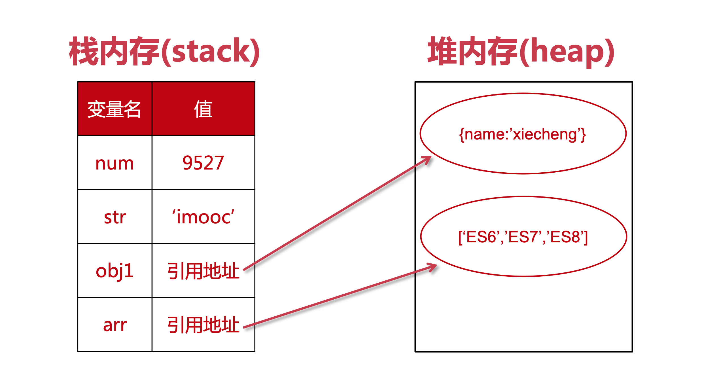

## 作用域

### 什么是作用域？

几乎所有编程语言就是在变量中存储值，并且能读取和修改此值。事实上，在变量中存储值和取出值的能力，给程序赋予了状态。 如果没有这样的概念，一个程序虽然可以执行一些任务，但是它们将会受到极大的限制而且不会非常有趣。 但是这些变量该存储在哪，又给如何读取？为了完成这个目标，需要制定一些规则，这个规则就是：作用域。

常见的作用域主要分为几个类型：全局作用域、函数作用域、块状作用域、动态作用域。

|     对象      |           类型           |
| :-----------: | :----------------------: |
| global/window |        全局作用域        |
|   function    | 函数作用域（局部作用域） |
|      {}       |        块状作用域        |
|     this      |        动态作用域        |

TIP

如果一个 变量 或者其他表达式不在 "当前的作用域"，那么JavaScript机制会继续沿着作用域链上查找直到全局作用域（global或浏览器中的window）如果找不到将不可被使用。 作用域也可以根据代码层次分层，以便子作用域可以访问父作用域，通常是指沿着链式的作用域链查找，而不能从父作用域引用子作用域中的变量和引用

#### 全局作用域

变量在函数或者代码块 `{}` 外定义，即为全局作用域。不过，在函数或者代码块 `{}` 内未定义的变量也是拥有全局作用域的（不推荐）。

```js
var course = "es"

// 此处可调用 course 变量
function myFunction() {
    // 函数内可调用 course 变量
}
```

上述代码中变量 `course` 就是在函数外定义的，它是拥有全局作用域的。这个变量可以在任意地方被读取或者修改，当然如果变量在函数内没有声明（没有使用 var 关键字），该变量依然为全局变量。

```js
// 此处可调用 course 变量

function myFunction() {
    course = "es"
    // 此处可调用 course 变量
}
```

以上实例中 course 在函数内，但是拥有全局作用域，它将作为 global 或者 window 的属性存在。

注意

在函数内部或代码块中没有定义的变量实际上是作为 window/global 的属性存在，而不是全局变量。换句话说没有使用 var 定义的变量虽然拥有全局作用域，但是它是可以被 delete 的，而全局变量不可以。
参考：https://www.runoob.com/js/js-scope.html

#### 函数作用域

在函数内部定义的变量，就是局部作用域。函数作用域内，对外是封闭的，从外层的作用域无法直接访问函数内部的作用域！

```js
function bar() {
    var testValue = 'inner'
}

console.log(testValue) // 报错：ReferenceError: testValue is not defined
```

如果想读取函数内的变量，必须借助 return 或者闭包。

```js
function bar(value) {
    var testValue = 'inner'

    return testValue + value
}

console.log(bar('fun')) // "innerfun"
```

这是借助 return 的方式，下面是闭包的方式：

```js
function bar(value) {
    var testValue = 'inner'

    var rusult = testValue + value

    function innser() {
        return rusult
    }

    return innser()
}

console.log(bar('fun')) // "innerfun"
```

通俗的讲，return 是函数对外交流的出口，而 return 可以返回的是函数，根据作用域的规则，函数内部的子函数是可以获取函数作用域内的变量的。

说到这其实大家会想到嵌套函数的作用域问题，如果 inner 函数再嵌套函数呢？这就涉及到另一个概念：作用域链。


仔细观察上图，其实不难理解作用域链是什么，因为你可以按照原型链那样去理解。任何一个作用域链都是一个堆栈，首先先把全局作用域压入栈底，再按照函数的嵌套关系一次压入堆栈。在执行的时候就按照这个作用域链寻找变量。

#### 块状作用域

在其他编程语言中，块状作用域是很熟悉的概念，但是在JavaScript中不被支持，就像上述知识一样，除了全局作用域就是函数作用域，一直没有自己的块状作用域。在 ES6 中已经改变了这个现象，块状作用域得到普及。关于什么是块，只要认识 `{}` 就可以了。

```js
if (true) {
    let a = 1
    console.log(a)
}
```

在这个代码中， `if 后 {}` 就是“块”，这个里面的变量就是拥有这个块状作用域，按照规则， `{}` 之外是无法访问这个变量的。

#### 动态作用域

在 JavaScript 中很多同学对 this 的指向时而清楚时而模糊，其实结合作用域会对 this 有一个清晰的理解。不妨先来看下这段代码：

```js
window.a = 3

function test() {
    console.log(this.a)
}

test.bind({
    a: 2
})() // 2
test() // 3
```

在这里 bind 已经把作用域的范围进行了修改指向了 ``{ a: 2 }``，而 this 指向的是当前作用域对象，是不是可以清楚的理解了呢？

接下来我们再思考另一个问题：作用域是在代码编写的时候就已经决定了呢，还是在代码执行的过程中才决定的？

```js
var course = " es"

// 此处可调用 course 变量
function myFunction() {
    // 函数内可调用 course 变量
}
```

在看看这段代码，写代码的时候就知道 course 就是全局作用域，函数内部的用 var 定义的变量就是函数作用域。这个也就是专业术语：词法作用域。 通俗的讲变量的作用域是在定义时决定而不是执行时决定，也就是说词法作用域取决于源码，通过静态分析就能确定，因此词法作用域也叫做静态作用域。 相反，只能在执行阶段才能决定变量的作用域，那就是动态作用域。

### 推荐阅读

- [什么是作用域](https://www.kancloud.cn/kancloud/you-dont-know-js-scope-closures/516610)
- [JavaScript深入之词法作用域和动态作用域](https://github.com/mqyqingfeng/Blog/issues/3)
- [深入理解JS中声明提升、作用域（链）和 this 关键字](https://github.com/creeperyang/blog/issues/16)

## Let

ES6 新增了let命令，用来声明变量。

#### 1. let 声明的全局变量不是全局对象window的属性

这就意味着，你不可以通过 window. 变量名 的方式访问这些变量，而 var 声明的全局变量是 window 的属性，是可以通过 window. 变量名 的方式访问的。

```js
var a = 5
console.log(window.a) // 5
let a = 5
console.log(window.a) // undefined
```

#### 2. 用let定义变量不允许重复声明

这个很容易理解，使用 var 可以重复定义，使用 let 却不可以。

```js
var a = 5
var a = 6

console.log(a) // 6
```

如果是 let ，则会报错

```js
let a = 5
let a = 6
// VM131:1 Uncaught SyntaxError: Identifier 'a' has already been declared
//   at <anonymous>:1:1
```

#### 3. let声明的变量不存在变量提升

```js
function foo() {
    console.log(a)
    var a = 5
}

foo() //undefined
```

上述代码中， `a` 的调用在声明之前，所以它的值是 undefined，而不是 Uncaught ReferenceError。实际上因为 var 会导致变量提升，上述代码和下面的代码等同：

```js
function foo() {
    var a
    console.log(a)
    a = 5
}

foo() //undefined
```

而对于 let 而言，变量的调用是不能先于声明的，看如下代码：

```js
function foo() {
    console.log(a)
    let a = 5
}

foo()
// Uncaught ReferenceError: Cannot access 'a' before initialization
```

在这个代码中， `a` 的调用是在声明之前，因为 let 没有发生变量提升，所有读取 a 的时候，并没有找到，而在调用之后才找到 let 对 `a` 的定义，所以按照 tc39 的定义会报错。

#### 4. let声明的变量具有暂时性死区

只要块级作用域内存在 `let` 命令，它所声明的变量就绑定在了这个区域，不再受外部的影响。

```js
var a = 5
if (true) {
    a = 6
    let a
}
// Uncaught ReferenceError: Cannot access 'a' before initialization
```

上面代码中，存在全局变量 `a` ，但是块级作用域内 `let` 又声明了一个局部变量 `a` ，导致后者绑定这个块级作用域，所以在let声明变量前，对 `a` 赋值会报错。

ES6 明确规定，如果区块中存在 `let` 和 `const` 命令，这个区块对这些命令声明的变量，从一开始就形成了封闭作用域。凡是在声明之前就使用这些变量，就会报错。

总之，在代码块内，使用 `let` 命令声明变量之前，该变量都是不可用的。这在语法上，称为“暂时性死区”

有时“暂时性死区”比较隐蔽，比如：

```js
function foo(b = a, a = 2) {
    console.log(a, b)
}
foo()
// Uncaught ReferenceError: Cannot access 'a' before initialization
```

#### 5. let 声明的变量拥有块级作用域

let实际上为 JavaScript 新增了块级作用域

```js
{
    let a = 5
}
console.log(a) // undefined
```

`a` 变量是在代码块 `{}` 中使用 let 定义的，它的作用域是这个代码块内部，外部无法访问。

我们再看一个项目中很常见的 `for` 循环:

```js
for (var i = 0; i < 3; i++) {
    console.log('循环内:' + i) // 0、1、2
}
console.log('循环外:' + i) // 3
```

如果改为 `let` 会怎么样呢？

```js
for (let i = 0; i < 3; i++) {
    console.log('循环内:' + i) // 0、1、2
}
console.log('循环外:' + i) // ReferenceError: i is not defined
```

继续看下面两个例子的对比，这时 `a` 的值又是多少呢？

```js
if (false) {
    var a = 5
}
console.log(a) // undefined
if (false) {
    let a = 5
}
console.log(a)
// Uncaught ReferenceError: a is not defined
```

### 思考

请问 `i` 的值是多少？

```js
for (var i = 0; i < 3; i++) {
    setTimeout(function() {
        console.log(i)
    })
}
// 3、3、3
```

答案是3次3。
但我希望的值是0、1、2，也就是每次保存住循环时候 `i` 的值，应该如何做呢？

方案1：闭包

```js
for (var i = 0; i < 3; i++) {
    (function(j) {
        setTimeout(function() {
            console.log(j)
        })
    })(i)
}
```

方案2：使用let

```js
for (let i = 0; i < 3; i++) {
    setTimeout(function() {
        console.log(i)
    })
}
```

大家可以把上面这段代码粘贴到 `babel` 中：https://www.babeljs.cn/repl , 看下经过 `babel` 转化为的 `ES5` 代码是什么样子的。

大家会发现其实 `babel` 把这段代码转化成了闭包的形式:

```js
"use strict"

var _loop = function _loop(i) {
    setTimeout(function() {
        console.log(i)
    })
}

for (var i = 0; i < 3; i++) {
    _loop(i)
}
```

相信通过这个思考题，大家对于 `let` 关键字的使用会有进一步的理解。

总结

使用let声明的变量：

- 不属于顶层对象window
- 不允许重复声明
- 不存在变量提升
- 暂时性死区
- 块级作用域

### 推荐阅读

- [内存管理](https://developer.mozilla.org/zh-CN/docs/Web/JavaScript/Memory_Management)
- [let](https://developer.mozilla.org/zh-CN/docs/Web/JavaScript/Reference/Statements/let)

## Const

不能被改变的叫做常量，请大家思考在 `ES5` 中如何定义一个常量呢？

`ES5` 中可以使用 `Object.defineProperty()` 来实现定义常量：

```js
Object.defineProperty(window, 'PI', {
    value: 3.14,
    writable: false
})
console.log(PI)
PI = 5
console.log(PI)
```

`const` 除了具有 `let` 的块级作用域和不会变量提升外，还有就是它定义的是常量，在用 `const` 定义变量后，我们就不能修改它了，对变量的修改会抛出异常。

```js
const PI = 3.1415

console.log(PI)

PI = 5

console.log(PI)
// Uncaught TypeError: Assignment to constant variable.
```

这个代码块中因为对 `PI` 尝试修改，导致浏览器报错，这就说明 const 定义的变量是不能被修改的，它是只读的。聪明的同学一定会发现只读属性是不是一定要进行初始化呢？

```js
const PI

PI = 3.1415
// Uncaught SyntaxError: Missing initializer in const declaration
```

注意

const 声明的变量必须进行初始化，不然会抛出异常 Uncaught SyntaxError: Missing initializer in const declaration。

### 重点来喽

```js
const obj = {
    name: 'xiecheng',
    age: 34
}
obj.school = 'imooc'
console.log(obj)
// {name: "xiecheng", age: 34, school: "imooc"}
```

大家会发现 `const` 定义的 `obj` 竟然被改变了... 这到底是为什么呢？有点懵啊...

这时我们就需要了解JS中的变量是如何存储的，见下图：



基本数据类型存储在 `栈内存` 中，引用数据类型存储在 `堆内存` 中然后在栈内存中保存 `引用地址` 。

TIP

`const` 实际上保证的并不是变量的值不得改动，而是变量指向的那个内存地址所保存的数据不得改动。

如何让对象或者数组这种引用数据类型也不被改变呢？

```js
Object.freeze(obj)
```

注意

`Object.freeze()` 只是浅层冻结，只会对最近一层的对象进行冻结，并不会对深层对象冻结。

总结

使用const声明的常量：

- 不属于顶层对象window
- 不允许重复声明
- 不存在变量提升
- 暂时性死区
- 块级作用域

### 推荐阅读

- [const](https://developer.mozilla.org/zh-CN/docs/Web/JavaScript/Reference/Statements/const)