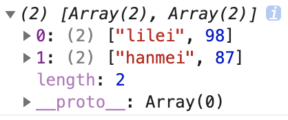
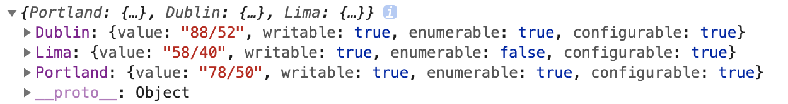

# Object 扩展

之前的语法如何获取对象的每一个属性值

```js
const obj = {
    name: 'imooc',
    web: 'www.imooc.com',
    course: 'es'
}
console.log(Object.keys(obj))
const res = Object.keys(obj).map(key => obj[key])
console.log(res)
// ["imooc", "www.imooc.com", "es"]
```

ES8中对象扩展补充了两个静态方法，用于遍历对象：Object.values()，Object.entries()

## 

> Object.values() 返回一个数组，其元素是在对象上找到的可枚举属性值。属性的顺序与通过手动循环对象的属性值所给出的顺序相同(for...in，但是for...in还会遍历原型上的属性值)。

```js
const obj = {
    name: 'imooc',
    web: 'www.imooc.com',
    course: 'es'
}

console.log(Object.values(obj))
// ["imooc", "www.imooc.com", "es"]
```

TIP

Object.values 是在对象上找到可枚举的属性的值，所以只要这个对象是可枚举的就可以，不只是 {} 这种形式。

## 

> Object.entries()方法返回一个给定对象自身可枚举属性的键值对数组，其排列与使用 for...in 循环遍历该对象时返回的顺序一致。（区别在于 for-in 循环也枚举原型链中的属性）

```js
let grade = {
    'lilei': 98,
    'hanmei': 87
}

for (let [key, value] of grade) {
    console.log(key, value) // Uncaught TypeError: grade is not iterable
}
```

我们知道 Object 是不可直接遍历的，上述代码足以说明直接遍历触发了错误。如果使用 Object.entries() 则可以完成遍历任务。

```js
let grade = {
    'lilei': 98,
    'hanmei': 87
}

for (let [k, v] of Object.entries(grade)) {
    console.log(k, v)
    // lilei 98
    // hanmei 87
}
```

这段代码确实成功的遍历了出来，但是上边说过 Object.entries 返回的是数组，这里面还用了数组的解构赋值，很多同学不明白是怎么结合的，其实很简单，看下 Object.entries 的返回值就好了：



结合这个图还有解构赋值的原理，就明白上述的代码是怎么工作的了。

## 

想理解 Object.getOwnPropertyDescriptors 这个方法之前，首先要弄懂什么是描述符(descriptor)？

```js
const data = {
    Portland: '78/50',
    Dublin: '88/52',
    Lima: '58/40'
}
```

还是上述那个对象，这里有 key 和 value，上边的代码把所有的 key、value 遍历出来，如果我们不想让 Lima 这个属性和值被枚举怎么办？

```js
Object.defineProperty(data, 'Lima', {
    enumerable: false
})

Object.entries(data).map(([city, temp]) => {
    console.log( `City: ${city.padEnd(16)} Weather: ${temp}` )
    // City: Portland         Weather: 78/50
    // City: Dublin           Weather: 88/52
})
```

很成功，Lima 没有被遍历出来，那么 defineProperty 的第三个参数就是描述符(descriptor)。这个描述符包括几个属性：

- value [属性的值]
- writable [属性的值是否可被改变]
- enumerable [属性的值是否可被枚举]
- configurable [描述符本身是否可被修改，属性是否可被删除]

如果想查看更多细节，访问 [Object.defineProperty](https://developer.mozilla.org/zh-CN/docs/Web/JavaScript/Reference/Global_Objects/Object/defineProperty)。

```js
console.log(Object.getOwnPropertyDescriptor(data, 'Lima'))
// {value: "58/40", writable: true, enumerable: false, configurable: true}
```

这个是获取对象指定属性的描述符，如果想获取对象的所有属性的描述符：

```js
console.log(Object.getOwnPropertyDescriptors(data))
```

返回数据： 

### 推荐阅读

- [Object.values()](https://developer.mozilla.org/zh-CN/docs/Web/JavaScript/Reference/Global_Objects/Object/values)
- [Object.entries()](https://developer.mozilla.org/zh-CN/docs/Web/JavaScript/Reference/Global_Objects/Object/entries)
- [Object.getOwnPropertyDescriptors()](https://developer.mozilla.org/zh-CN/docs/Web/JavaScript/Reference/Global_Objects/Object/getOwnPropertyDescriptors)