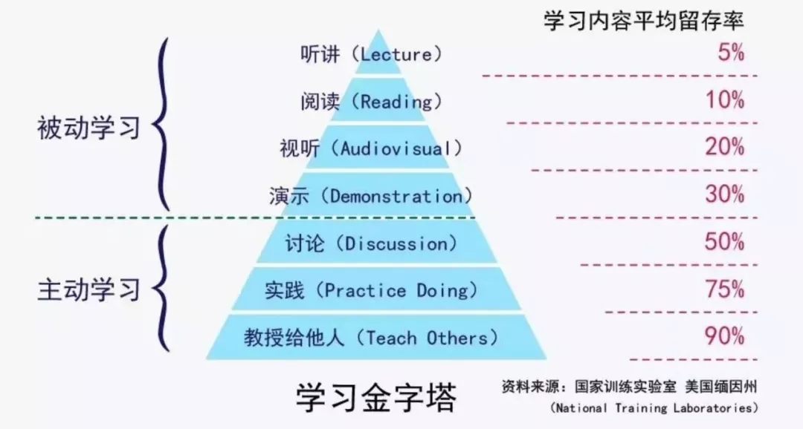

## 引言

一直想谈谈学习方法的一些东西，终于耗费了一周时间写完了。本文篇幅较长，如果耐心读完我想一定会对你多少有一定帮助。

个人的知识水平受限，理解一定是具有局限性的。希望我的一些经历可以帮助到大家，也是自我的一次反思和总结。学习是一个不断的过程，若是若干时间后有更多的学习感悟，我也会一直更新。

有不对的地方欢迎留言指正 🙏🏼

## 一、为什么要讲学习方法

在学习技术这条路上并不是一帆风顺，也一直在探索一条适合自己的学习方法。从一开始的技术小白，到现在还比较上道的老鸟，在这个过程中走了太多的弯路，想在这里和大家分享一些我的经历和学习方法。

对于立志成为一个技术达人，或者对于技术有执着追求的，学习一定是伴随着终生。所谓的互联网还是国企养老的说法更是根本不存在的，一旦进入所谓的舒适区，很可能下一个末位淘汰的就是你。我不认为从业者过度的关注什么互联网寒冬的说法，应该从提升技术素养出发，找到自己感兴趣的方向。要相信大部分金子都可以发光发热的，当然伯乐很重要。

技术是科学、是工具、更是理论应用于实践的途径。技术学习是无止境的，人的精力也是有限的，我们不应该一味的追求新技术。基础很重要，特别是数据结构与算法、操作系统原理、计算机网络、Linux 基础，这些在如今应用层编码的过程中或许不会被过多的关注，但是计算机的基础决定了你能走多远。从某一个技术点的深度着手，同时不断扩展自己知识的广度。项目需要什么就用什么学什么，业余时间当然可以扩展一下自己感兴趣的技术栈。

在本文想和大家分享一些我的学习方法和经验，希望对大家有所启发。

## 二、和技术有关的日子

### 1. 从懵懂到想做技术

从我的个人学习经历说起吧，学习的过程挺曲折的，但是回首过去发现这些经历的都将成为你未来的谈资。从进入大学开始，个人的对于摄像与平面有浓厚的兴趣，也花了整整三年的时间投身于学生工作（主要是平面设计、视频后期、微信公众号运营相关的），一度的规划是希望成为一个设计师或是视频后期工作者。也跟随很多摄制组拍摄过广告、做过平面设计物料、微信公众号媒体运管，我认为一个好的设计一定是给人带来美的享受，对于追求完美主义的我，深深的爱上了这个角色。

与此同时，本科作为软件工程专业出身的我，同时被各种计算机的学科熏陶着，自认为技术掌握的还不错。那个时候对于 Web 特别感兴趣，特别现在的人们打开计算机，大部分时间都是和你的浏览器相处。那个时候开始学习一些 HTML/CSS/JavaScript 相关的一些东西，可以自己做一些简单的静态网页，很快不久就写了一个非常简陋的个人主页。后来，接触了动态网页写过 JSP、ASP.NET、PHP 网页，但是那时候大部分还是前后台混合渲染的方式，开发效率倒是很高但是一旦想要从新设计前端界面，就会陷入重构的泥塘。后来，慢慢接触到了前后台分离的开发方式，知道了 Vue、React 相关的一些 MVVM 框架。

在 2015 年的学生工作中，马上迎来了学代会的换届选举，在过程中发现纸质选票效率低，通常中场投票和检票也耗费大量的时间。我算是一个善于发现问题的人，两天时间泡在图书馆中，搭建了一个学代会投票系统。在后来的投票过程中，我将原来的 30 分钟，缩短到了 5 分钟，并在大屏实时滚动显示投票柱状图。这个投票系统也得到了团委老师的一致认可，在后来的 4 年中一直使用了我的投票系统，并且保持了很好的稳定性和效果。在每一年的系统中，我也不断的升级投票系统，在这几年的升级过程中也记录了自己的成长轨迹。虽然毕业了，但口碑的也在各个学院中流传开了，也正在计划将它升级为一个平台，可以让所有注册到平台上的人都可以使用我的投票平台。

在设计师和技术研发人员的角色选择中，纠结过很长一段时间。会发现，设计师可以设计出很简洁、美观、善心悦目的作品，但是只有技术研发人员才能实实在在的为它赋能，真正的实现一个具有功能性、体验性的东西。他们都是艺术家，都在各自的领域增添异彩。我从来不认为开发的是功能，每一行代码都有它的灵魂，都是我的产品，更是我的尊严。在后来的日子里，我发现这两个角色对于逐渐开始并存，为什么不能够同时应用和学习呢？做设计中最懂技术的，做技术中最懂设计的。

同时在过去三年的学生工作中，也很好的锻炼了我的团队领导能力和技术分享能力。这些软实力，也许和很多的代码能力都无关，但是在后来的项目团队协作和管理中有着潜移默化的帮助。

### 2. 我的成长与技术路线

从大三的暑假到目前的研究生阶段，开始学习前端开发技、跨平台应用、后台开发技术、了解系统架构的一些东西、机器学习算法应用、产品设计思维等等相关的东西。我开始了技术广度的挖掘，很多东西不敢说是精通，但至少一定是入门到进阶的水平，当然目前还在技术深度不断学习的路上。

我很认可一句话，“人人都是产品经理”，“人人都是架构师”。我们不应该为自己打上太多的标签，“我是一个算法工程师”、“我是一个 XX 语言开发工程师”、“我是一个产品经理”。在学习这条路上，我们应该首先抓好自己的本职工作，也就是技术深度的学习(例如：开始学会重构自己的项目代码、开始看项目源码)，从而在工作之余不断的拓展自己技术的广度和思维的广度。这里说一个题外话，谷歌宣扬的 80% 的时间用来工作，20% 的时间用来学习，大名鼎鼎的 Go 语言就是三位科学家利用 20% 时间里创造的。

一个追求用户极致体验的你，为产品而创造的你，未来也可能成为乔布斯一样优秀的产品经理。执着追求技术，那么未来你可能成为某个领域的技术专家或是某个维度的系统架构师。在追求技术的同时，有长远的战略眼光，有可能成为一个技术总监。有广阔胸怀的，赏识人才，能有调理的管理好一批人，有市场洞察力，能将技术变现，那未来离财务自由不远了。

后来的我读研了，由于是专硕，两年的读研时间显的好短暂，才短暂接触了几个月的机器学习算法，都才刚刚入门了 Python 和会使用 Tensorflow 和 Scikit-learn 框架进行一些简单的机器学习分类工作，马上又要着手于校招，让我措手不及。在机器学习算法等相关学科，对于数学功底要求比较高，对于快速就业让我十分的无助。由于之前也写过几年的 PHP 后台开发相关的工作，大概在很长的一段时间内一直在纠结究竟是找机器学习岗位或是后台开发方向。

思考了很久，我对自己未来的规划是希望成为架构师方向，在技术达到一定高度，并有很好的想法的时候会有创业做产品的打算。于是我还是回到了自己的老本行，后台开发的方向，当然不仅仅只会关注后台相关的技术点，也会在业余时间学习一些算法和前端技术栈。逐渐的，不断在不同维度中学习技术，不断成长。

总之在技术快跑的过程中，我们不仅仅要学会一门精通的手艺，同时也要有自己的辅助第二技术或是第三技术。要学会用后台思维写前端，算法思维写后台，产品思维写算法。我们做的不仅仅是功能，要让每一行代码都具备灵魂。

个人对于产品是非常热爱的，这几年互联网的高速发展，整个中国发生了翻天覆地的变化。国民的衣食住行都发生了巨变，吃饭——美团、点评、饿了么，买衣服——淘宝、唯品会、京东，出行——哈啰单车、各种共享电动车、滴滴出行、曹操专车，住房——自如、贝壳找房、58 同城，还有改变生活方式的微信和支付宝。他们都将逐步成为我们生活中的水电煤，逐步融入人们的血液。在技术水平和思维格局到达已经层次，十分希望在未来的日子，在某个对的时刻能够创造一个影响一个时代的产品。

*(图：技术路线与管理路线)*

## 三、如何学习与技术快跑

上文通过自身经验举例，说了一些自己的技术成长路线。下面来谈谈技术学习的一些方法论，主要围绕以下四个部分进行讨论：

- 技术架构
- 极限编程
- 学习总结
- 技术分享

### 1. 技术架构

在学习技术前，我不知道大家是怎样的一种心态。我喜欢把技术比作一栋大厦，大部分人都会从大门进入，一步一步往上走，技术也在一点点的提高，但很多人大部分时候都会质疑自己学来到底有什么用，或是会遇到一些技术瓶颈，或是很多时候迷茫了也不知道该学习哪些东西。

技术的成长我认为分成三个层次：**我不知道我不知道**，**我知道我不知道**，**我知道我知道**。从技术的小白，到技术小达人，再到技术牛人。

在这栋技术大厦中，在技术小白阶段，就是按部就班的往上爬，但是当你技术学习到一定程度的时候，你必须开始了解整栋大厦的框架结构。所以在这里，必须要开始转向系统架构。***这里摘抄一段《许式伟：架构设计的宏观视角》中的话，也正是我们想要表达的思想。\***

> 如同造房子有建筑工人（负责搬砖）和建筑师（负责架构设计）一样，软件系统的开发过程同样需要有程序员（负责搬“砖”）和架构师（负责架构设计）。作为架构师，我们需要的第一个能力是宏观的全局掌控能力。
>
> 如果把应用程序比作一座大厦，那么我们作为大厦的架构师，需要把大厦的结构搭建好，让程序员可以把砖填充进去，我们都知道，一个大厦的结构建得是否稳固，与地基密不可分。
>
> 所以，我们首先就需要从大厦的地基开始，熟悉这座大厦。毕竟，你对所依赖的基础架构了解得越全面，做业务架构设计就会越发从容。

技术想要成长，必须首先在思想上成长，提升自己的技术思想高度。一个不想成为建筑师的包工头不是一个好的架构师，在学习这条往上的路上，必须要学会用宏观视角来解决问题。在技术成长的过程中，有时候不需要太多的注意某个细节是怎么实现的，而是要有技术判断力，技术是否可行，技术如何选型。

下面给大家列一下，后台开发工程师需要达到的一个高度吧，做一个简单的感知。

- 数据结构与算法实战
  - Leetcode
  - 剑指 Offer
- 内功修炼
  - 数据结构与算法
  - 海量数据处理方法
  - Linux 基础与命令
  - 计算机网络（应用层，传输层，网络层等相关协议）
  - Web 网络和 HTTP/HTTPS 协议
  - 数据库（MySQL，Redis）
  - 操作系统原理
  - Git 版本管理工具使用
  - 正则表达式
- Java 核心技术
  - 语法与基础概念
  - 面向对象与 23 种设计模式
  - Java 容器源码（数据结构 & 源码分析：ArrayList、Vector、LinkedList、HashMap、ConcurrentHashMap、HashSet、LinkedHashSet and LinkedHashMap）
  - Java 并发编程（线程状态、线程机制、线程通信、J.U.C 组件、JMM、线程安全、锁优化）
  - Java IO（磁盘操作、字节操作、字符操作、对象操作、网络操作、NIO）
  - Java 虚拟机（运行时数据区域、垃圾收集、内存分配机制、类加载机制、性能调优监控工具）
  - Java Web（学习 SSM + SpringBoot 框架和设计模式思想）
- 分布式解决方案
  - SpringCloud
  - Zookeeper（分布式协调服务）
  - Dubbo（分布式服务治理）
  - 分布式事务解决方案
  - ActiveMQ、Kafka、RabbitMQ（分布式消息通信）
  - Redis（分布式缓存与集群搭建）
  - mycat（数据库路由）
  - Nginx（反向代理）
  - Docker（容器技术）
  - Tomcat

- 最后推荐一些阅读脚本
  - 一张[后台开发技能图谱](https://www.frankfeekr.cn/2019/04/17/后台开发技能图谱/)分享给大家
  - 整理了一些[阅读清单与学习课程⎡计算机学习的“武林秘籍”⎦](https://www.frankfeekr.cn/2019/04/19/cs-learning-list/)，欢迎大家学习

### 2. 极限编程

接着，来聊聊极限编程。极限，就一个字"快"！

身边也经常有很多人，常常在每次项目中，都没来得及系统学习技术栈就要开始项目开发了；大部分的时间都在复制粘贴，面向搜索引擎编程，找不到自己的技术核心点。

包括自己在内，很多时候也都希望当自己掌握了完整的一套技术栈以后再开始你的项目编码。经历过很多项目之后，我会发现其实这并不是正确的做法。同样的，这也遵循二八定律，在技术中我们只要花少量的时间学会 20% 的技术，就可以开始项目开发，剩下的 80% 大部分都应该在项目实践中去学习的。

在很多的项目中，根本来不及有太多的时间让我们学习。很可能一个新的技术，通过短短 5-7 天的学习，就必须要应用到项目中去，很难有太多的时间让你系统学习。特别在互联网的应用场景中，时间就是金钱，一个好的想法，必须在最短的时间内上线。极限编程正是这样一种敏捷快速的开发方式，要求团队成员拥有很高的技术素养，在很短时间内就可以学会并且应用。

在这里，我们从个人的经验，分享我在极限编程学习过程中的路线：

- **先看技术效果**
  - 学会检索一些牛逼的项目，看看通过这个技术可以达到什么样的效果，判断是否满足自己的需求。
  - 结果导向的学习，更加能提升我们的学习兴趣。
- **快速视频学习入门(10小时以内)**
  - 特别像我一样学习不太喜欢看书，感觉到很枯燥的同学，我推荐直接找视频快速入门，视频不宜太长，10小时左右(2.0x 速度看)。快速的了解技术的状况，掌握基本的核心技术，会的部分直接跳过。
  - 这里推荐一些好的学习网站：慕课网、极客时间、哔哩哔哩、极客学院、实验楼、学堂在线。
- **开源小项目**
  - 在视频学习入门之后我们可能还不具备一个项目的编码能力，这时候我们可以找一些开源项目来跑一跑（学会使用 GitHub），项目不宜太复杂，一个简单的小项目即可。
- **配合文档同步学习**
  - 技术文档不像小说，一定更不要从头到尾的读，选择有必要的部分尝试通读，但是大部分的文档应该作为字典一样的查询工具书。
- **开始投入项目生产**
  - 终于可以正式开始项目实践了，选择好自己的项目框架，配合文档、视频，不会的部分当然还得靠搜索引擎。
- **项目复盘与重构**
  - 重新审视自己的代码，有条件的应该让大神给你看看，指点一下代码，以便在未来升级改进。
- **技术进阶，重新回到书本(或是项目文档)**
  - 无论你在搜索引擎找到的答案，都是比较碎片化的知识。当你想要深入到底层或是原理相关的部分，你应该选择一本大众认可的书籍进行深入阅读，大部分的书才是一个最系统和深入的学习。当然要看技术点的感兴趣和必要成分，不是所有的技术都需要深入了解，但是在自己的技术领域应该还是需要不断精通和升华。

### 3. 学习总结

在技术学习的过程中，我们可能会遇到很多的技术难点，还会遇到很多碎片化的检索工作，很多技术点我们肯定是不可能都记住甚至背下来。经常，我们会遇到一些常见遇到一些常见的东西，每次见到我们都要重新谷歌检索一遍，浪费了大量的时间。所以，学习总结是非常有必要。

都说好记性不如烂笔头，定期的学习和整理必然对学习巩固有所帮助，这里通过索引的方式对技术做一个系统分类，方便随时巩固和学习，当然还有面试。在学习这条路上难免会有很多盲点和学不完的知识。有道无术，术尚可求，掌握好思维能力才能应对千变万化的技术。不要把大脑当成硬盘，也不要做高速运转的 CPU，而修行自己的大脑成为一个搜索引擎，学会分析解决问题。

个人也是因为 MarkDown 而爱上的写作，这里盘点一些学习总结的方式：

- 技术博客 & 微信订阅号
  - 首先技术博客是一个非常好的途径，可以通过掘金、CSDN、知乎专栏、知识星球等等途径编写自己的技术博客。
  - 稍微极客一点的同学可以自己搭建一个自己的博客，例如：WordPress、Hexo、Hugo 这样的博客。(推荐使用 Hexo + GitHub + Typora + MD 来写自己的技术博客)。欢迎来我的博客逛逛：https://www.frankfeekr.cn/
  - 在技术博客的编写过程中，首先对你知识的回顾是很有帮助的，其次也将成为你的个人检索宝库，把自己常见的一些问题都记录在你的博客中，再下一次遇到的时候就可以信手捏来。
  - 很多著名的技术书籍早期都是通过博客来积累自己的素材，当你的技术和文字达到一定功底，我想出书也是非常自然而然的事情。
  - 此外还可以申请个人的微信订阅号来编写自己的技术博客，这也是一个很好的传播途径，慢慢的积累自己的粉丝哈哈。欢迎关注我的微信公众号，[“全栈开发社区”](https://raw.githubusercontent.com/frank-lam/fullstack-tutorial/master/assets/wechat-fullstack3.png)。
- GitHub 开源项目
  - GitHub 不仅仅可以分享代码性质的项目，当然在上面你还可以开源自己博客项目，你可以通过 `.md` 来记录自己的技术博客。
  - 很多开源的书籍、文档翻译项目都可以通过 GitHub 来托管
  - 通过 GitHub 你还获取到了版本控制的文本和图床，这相比自己搭建服务器来构建博客更加的方便和安全，并且永不丢失。
  - 欢迎看看我在 GitHub 上的技术项目：https://github.com/frank-lam/fullstack-tutorial
- 其他
  - 此外你还可以通过诸如：为知笔记、有道云笔记等方式进行学习总结
  - 最后建议大家不要再用你的 txt 或是 word 来记录你的笔记

### 4. 分享技术

学习金字塔是美国缅因州的国家训练实验室研究成果，它用数字形式形象显示了：采用不同的学习方式，学习者在两周以后还能记住内容（平均学习保持率）的多少。

在金字塔基座位置的学习方式，是“教别人”或者“马上应用”，可以记住 90% 的学习内容。通过学习金字塔，我们会发现学习最好的方式应该是主动学习并且学会分享教授别人如何学习。在教授别人的过程中，我们在输出知识，也在不断的输入别人的疑惑，看似单向学习的过程中实际上也是双向的学习，不断的巩固自己的知识。

那么在技术学习中呢？没错我们不仅要学会倾听别人的技术，很多时候我们要学会分享技术。要知道一个好的技术管理者，必须要学会根据团队成员的不同情况，制定不一样的培养方案，这也是很重要的一个能力。通过分享你的技术，同时你也会不断的巩固自己的逻辑能力和技术表达能力。

*(图：学习金字塔，图片来源网络)*

## 四、最后几句话

技术学习的路是很长的，需要我们掌握好高效的学习方式，终身学习。

你要相信自己，可以通过 20 小时学会任何技能，也能通过 10000 小时成为某个领域的资深专家。在立足于本身技术深度学习的同时，也记得拓展自己思维的广度。

只有一个好的技术学习方法 ，才能让你在如今不断动荡的互联网江湖中，屹立不倒、处变不惊。