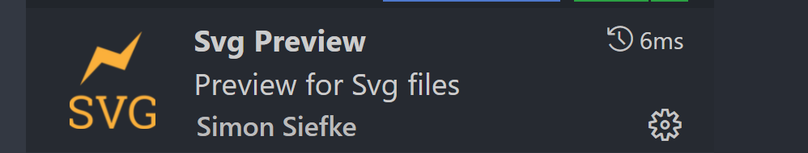

# Visual Studio Code

## 插件

### 1. Increment Selection

>  编辑多行，插入递增数字

插件市场：[Increment Selection - Visual Studio Marketplace](https://marketplace.visualstudio.com/items?itemName=albymor.increment-selection)

```markdown
# Win\Linux:
ctrl + alt + I
ctrl + shift + P => Increment Selection

# Mac:
cmd + alt + I
cmd + shift + P => Increment Selection
```

默认起始数字是0， 如果想改变起始数字，在多行编辑前将第一项改为想要的数字，多行选中后再使用快捷键。


### 2. Sort line


### 3. Svg Preview - Visual Studio Marketplace

SVG 图片预览插件：[Svg Preview - Visual Studio Marketplace](https://marketplace.visualstudio.com/items?itemName=SimonSiefke.svg-preview)



